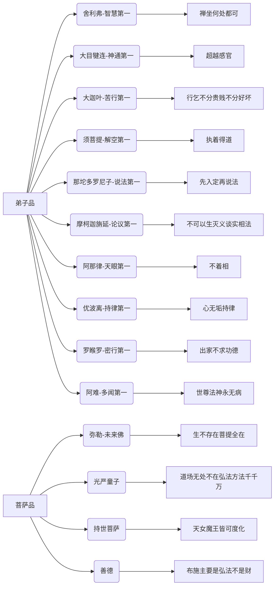

# 维摩诘经

[toc]

## 结构

### 弟子品

```mermaid
graph LR
舍利弗(舍利弗-智慧第一) --> 禅坐何处都可
大目犍连(大目犍连-神通第一) --> 超越感官
大迦叶(大迦叶-苦行第一) --> 行乞不分贵贱不分好坏
须菩提(须菩提-解空第一) --> 执着得道
那坨多罗尼子(那坨多罗尼子-说法第一) --> 先入定再说法
摩柯迦旃延(摩柯迦旃延-论议第一) --> 不可以生灭义谈实相法
阿那律(阿那律-天眼第一) --> 不着相
优波离(优波离-持律第一) --> 心无垢持律
罗睺罗(罗睺罗-密行第一) --> 出家不求功德
阿难(阿难-多闻第一) --> 世尊法神永无病

弟子品 --> 舍利弗
弟子品 --> 大目犍连
弟子品 --> 大迦叶
弟子品 --> 须菩提
弟子品 --> 那坨多罗尼子
弟子品 --> 摩柯迦旃延
弟子品 --> 阿那律
弟子品 --> 优波离
弟子品 --> 罗睺罗
弟子品 --> 阿难


弥勒(弥勒-未来佛) --> 生不存在菩提全在
光严童子(光严童子) --> 道场无处不在弘法方法千千万
持世菩萨(持世菩萨) --> 天女魔王皆可度化
善德(善德) --> 布施主要是弘法不是财

菩萨品 --> 弥勒
菩萨品 --> 光严童子
菩萨品 --> 持世菩萨
菩萨品 --> 善德
```

```mermaid
graph LR


```

