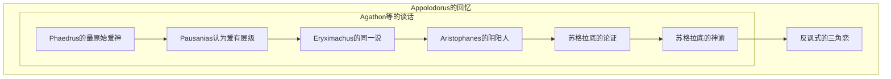

# The Symposium

# META

**创建日期**: 2021-07-27

**参考等级**: ⭐⭐⭐⭐⭐🌕

**关联**: 

**标签**: #2021-07-01

**引用**: Plato. *The Symposium*. Translated by M. C. Howatson. Cambrdige Texts in the History of Philosophy. Edited by M. C. Howatson and Frisbee C. C. Sheffield. Cambridge, New York: Cambridge University Press, 2008.

## 概述

# 结构

## 总体结构

# 正文分析

## 人物设定

-   [Phaedrus](https://en.wikipedia.org/wiki/Phaedrus_(Athenian) "Phaedrus (Athenian)") (speech begins 178a):[[19]](https://en.wikipedia.org/wiki/Symposium_(Plato)#cite_note-19) an Athenian aristocrat associated with the inner-circle of the philosopher Socrates, familiar from _[Phaedrus](https://en.wikipedia.org/wiki/Phaedrus_(Plato) "Phaedrus (Plato)")_ and other dialogues
-   [Pausanias](https://en.wikipedia.org/wiki/Pausanias_(Athenian)) (speech begins 180c): the legal expert
-   [Eryximachus](https://en.wikipedia.org/wiki/Eryximachus "Walter Hamilton (Master of Magdalene College)") (speech begins 186a): a [physician](https://en.wikipedia.org/wiki/Physician "Physician")
-   [Aristophanes](https://en.wikipedia.org/wiki/Aristophanes "Aristophanes") (speech begins 189c): the eminent [comic playwright](https://en.wikipedia.org/wiki/Ancient_Greek_comedy "Ancient Greek comedy")
-   [Agathon](https://en.wikipedia.org/wiki/Agathon "Agathon") (speech begins 195a): a tragic poet, host of the banquet, that celebrates the triumph of his first [tragedy](https://en.wikipedia.org/wiki/Tragedy "Tragedy")
-   [Socrates](https://en.wikipedia.org/wiki/Socrates "Socrates") (speech begins 201d): the eminent philosopher and Plato's teacher
-   [Alcibiades](https://en.wikipedia.org/wiki/Alcibiades "Alcibiades") (speech begins 214e): a prominent Athenian statesman, orator, and general

# 文摘

>    Phaedrus, that Love is not only supreme in beauty and goodness himself but is also the source of beauty and goodness in all other things. Indeed, I feel I must speak about him in verse and say that it is he who creates (197c)

>    Love such that he is love of something, or is he love of nothing?(199d)

>    consider whether it isn’t necessarily true that that which desires, desires what it lacks, or, put another way, there is no desire if there is no lack. (200a)

>    So, then, he desires the possession and presence in  the future of those things which he has at present. But isn’t this  equivalent to loving that thing which is not yet available to him and  which he does not yet have?

>    Isn’t Love, first, of something, and, secondly, of something that he lacks?

>    What is the function of a spirit?’’ I asked.  
>    ‘‘Interpreting and conveying all that passes between gods and  humans: from humans, petitions and sacrificial offerings, and from gods, instructions and the favours they return. Spirits, being intermediary, fill the space between the other two, so that all are bound together into one entity. It is by means of spirits that all divination can take place, the whole craft of seers and priests, with their sacrifices, rites and spells, and all prophecy and magic. Deity and humanity are completely separate, but through the mediation of spirits all converse and communication from gods to humans, waking and sleeping, is made possible. The man who is wise in these matters is a man of the spirit, whereas the man who is wise in a skill or a manual craft, which is a different sort of expertise, is materialistic. These spirits are many and of many kinds, and one of them is Love’’.

>    Love is the desire to possess the good always.

# 评论
