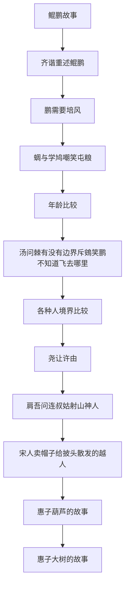

# 陈鼓应《庄子》

# META

**创建日期**: 2021-10-31

**参考等级**: ⭐⭐⭐⭐

**关联**: 

**标签**: #2021-10-01; #庄子; #南华经; #陈鼓应; #先秦哲学; #道家

**引用**: 庄子. *庄子今注今译*. Translated by 陈鼓应. 中国古典名著译注丛书. 北京: 中华书局, 1983.

## 概述


# 结构

## 总体结构

```mermaid
graph TD

```

## 内篇
### 逍遥游



# 正文分析

# 文摘

# 评论
