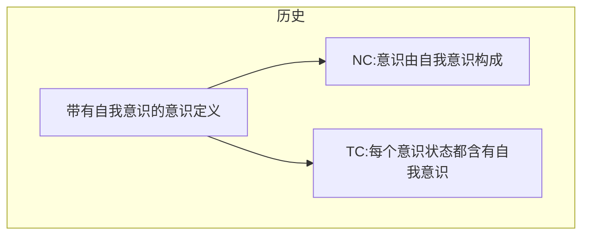

# The Varieties of Selflessness

## Reference

Metzinger, Thomas. "M-Autonomy." Journal of Consciousness Studies 22, no. 11-12 (2015): 270-302.

## 结构

### 作为自己的自己的意识(consciousness of oneself as oneself)

#### 六个层面

1. 认知自我意识：认为自己是自己
2. 空间自我意识：意识到感知所在的位置是属于自己的
3. 身体属有的感觉(sense of bodily ownership): 意识到自己的身体是自己的
4. 身体能动的感觉(sense of bodily agency): 意识到自己身体的行为是属于自己的
5. 精神属有的感觉(sense of mental ownership): 意识到自己的精神状态是属于自己的
6. 精神能动的感觉(sense of mental agency): 意识到自己的精神活动是属于自己的

NC合取方式的定义：

对于任何主体S，如果在t时S是意识到的，那么S的现象内容包括上面说的6个方面的现象特征。、

### 部分无我

PSL：对于主体S来说是一种全局的意识状态，我们称他为「部分无我」当且仅当，在这种状态中，S至少有一种方式具有自我意识，但是缺少同时部分自我意识。

TSL：对于主体S来说是一种全局的意识状态，我们称他为「全部无我」当且仅当，S失去了任何一种自我意识。

#### 反驳认知自我意识

1. 当做在计算题或者做盘算的时候(flow states)，完成任务时，会有忘我的状态；而且发现，意识越执行在任务上表现越好。
2. 冥想：只会注意到感觉刺激。当意识关注点定住时，心会平静，会更少有自我指射的思想。
3. REM睡眠时的梦，只有20%包含思考，只能概括其5%的内容

#### 反驳空间自我意识

1. flotation tanks(?)：会体验到缺少自身定位的感觉。
2. Usher症候群 ：可能会导致聋瞎、听觉和视觉丢失。有一些例子会体验到自己丧失自我定位的感觉。
3. 专业冥想者

#### 反驳身体属有感

1. 身体妄想症（somatoparaphrenia）和人格解离（depersonalization）患者：体验到身体不是指自己的
2. OBE(out-of-body experiences)：灵魂出窍感（59%的vestibular 患者有OBE）

#### 反驳身体能动感

1. 存在一些非自主的无意识行为，以及条件反射
2. 体验到身体不可动感，全身麻痹
3. 在梦中不会有做梦身体的感觉

#### 反驳精神属有感

有些报道存疑，因为有「过度解读」疏离感的感觉

1. 人格解离换着偶有报道失去精神属有的感觉。他们会说，这不是「我」在感觉
2. 精神分裂症
3. 非清醒梦(nonlucid dreams)和神游(mind-wandering, 一种疾病)，会有这种感觉。

#### 反驳精神能动感

神游时，是没有自我控制精神的感觉的

#### PSL的种类

|                          情况 |    CSC     |    SSC     |    SBO     |    SBA     |    SMO     |    SMA     |
| ----------------------------: | :--------: | :--------: | :--------: | :--------: | :--------: | :--------: |
|          神游(mind-wandering) |    :x:     | :question: | :question: | :question: | :question: |    :x:     |
|                   flow states |    :x:     | :question: | :question: | :question: | :question: | :question: |
|                          冥想 |    :x:     |    :x:     | :question: | :question: | :question: | :question: |
|                      非清醒梦 |    :x:     | :question: | :question: | :question: |    :x:     |    :x:     |
|                    无身体感梦 |    :x:     | :question: |    :x:     |    :x:     |    :x:     |    :x:     |
|                        聋盲症 | :question: |    :x:     | :question: | :question: | :question: | :question: |
| 感官剥夺(sensory deprivation) | :question: |    :x:     | :question: | :question: | :question: | :question: |
|                          OBEs | :question: | :question: |    :x:     |    :x:     | :question: | :question: |
|                    身体妄想症 | :question: | :question: |    :x:     |    :x:     | :question: | :question: |
|                  药物引发状态 | :question: | :question: |    :x:     |    :x:     | :question: | :question: |
|                      人格解离 | :question: | :question: |    :x:     |    :x:     |    :x:     | :question: |
|                      全身麻痹 | :question: | :question: | :question: |    :x:     | :question: | :question: |
|   思想入侵(thought insertion) | :question: | :question: | :question: | :question: |    :x:     |    :x:     |
| 非自愿思想(unbidden thoughts) | :question: | :question: | :question: | :question: | :question: |    :x:     |

### TSL

#### 药物引发的自我解体(DIED)

drug-induced ego dissolution (DIED)： 莫斯卡灵药(mescaline)、LSD、psilocybin(二甲-4-羟色胺磷酸)。

主要有大量证实的是DMT(5-MeO-DMT)

#### 冥想

Samādhi(三么地、奢摩他)

#### 清醒无梦睡眠(Lucid dreamless sleep)

yogic sleep: 见证睡眠(witness sleep)在无梦却清醒的状态

### 反驳和回应

#### obj. 1: 不存在TSL，因为没有体验是可以没有主体体验的

主体体验和自我意识是不同的。

#### obj. 2: 不存在TSL体验，因为这样意识就不存在任何内容了

TSL会具有现象学特征，但是不一定需要自我意识的体验。一些极端的例子中，甚至可以没有现象学体验

#### obj. 3: 存在一个自我意识的形式是更基本的，文章没有讨论。

#### obj. 4: TSL不存在自传性记忆(autobiographical memory)，所以，这些体验的报道是值得怀疑的

事实上，这类报告可以还原为「there was no me」的表述而不是「I had an experience without ...」

1. how to define autobiographical memory, or how it relates to the standard taxonomy of declarative memory 
2. whether all episodic memories are autobiographical  
3. the mnemonic representation of putative selfless states might involve first-person content even though the original experience did not.   

## 文摘

### 1. 常规地对于意识的定义含有「自我意识」

> a subject’s overall experience involves a sense of self at t if and only if (a) the subject is self-conscious at t, and (b) the subject’s being self-conscious at t makes a constitutive contribution to her overall phenomenology at t  

### 2. NC: 必要性声明

> For any subject S, if S is conscious at t, then (a) S is self-conscious at t, and (b) S’s being self-conscious at t makes a constitutive contribution to S’s overall phenomenology at t  

### 3. TC: 典型性声明

> For any healthy, neurotypical, adult human subject S, in any ordinary condition in which S is conscious, (a) S is self-conscious, and (b) S’s being self-conscious in that condition makes a constitutive contribution to S’s overall phenomenology.

### 4. NC_disj： NC合取形式声明

> NC_disj: For any subject S, if S is conscious at t, then S’s phenomenology involves any of the phenomenal features (1–6) at t (including any combination of these features)  

### 5. PSL： 部分无我

> **PSL**: A global state of consciousness of a subject S is partially selfless if and only if, while being in that state, S is not self-conscious in at least one of the ways in which S can be self-conscious, but does not lack all of the ways in which S can be self-conscious at the same time.  