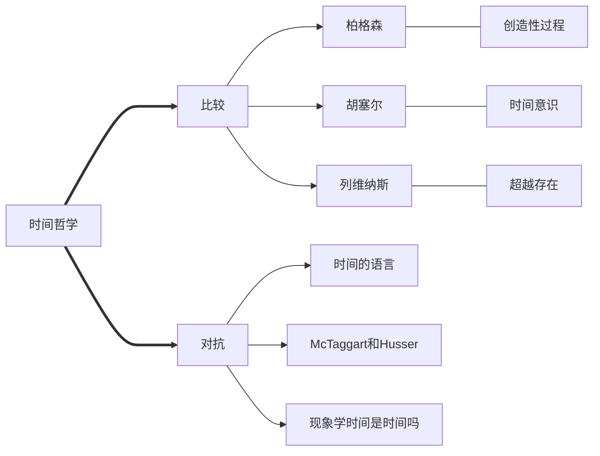

# Philosophy of Time: Time before Times

## META

**创建日期**: 2021-01-20

**参考等级**: ⭐⭐⭐

**关联**: 

**标签**: #时间; #时间哲学;

**引用**: McLure, Roger. *Philosophy of Time: Time before Times*. Routledge Studies in Twentieth-Century Philosophy. London, New York: Routledge, 2005.

### 概述

## 结构

### 总体结构

## 正文分析

### 伯格森

标签: #柏格森

#### 介绍

大部分人批评伯格森理论不够精确(pp. 9)，伯格森却认为他们违反了精确的第一准则，大部分人的解释都附着于客体(object)上(pp. 9)。

伯格森有独立于英国哲学的「经验主义」流派，他称之为「真的经验主义」(true empiricism)，依照直觉性的内容作为经验素材。(pp. 10)

法国哲学一部分吸收伯格森的观点，伯格森本质上是反对康德的，而另一部分则是吸收胡塞尔的现象学，这个确实继承自康德的。(pp. 11)

#### 时间和实体

* Duree是纯粹的时间流动本身，不包含任何事物变化的过程(pp. 12)
* 时间是具体的，定性的(pp. 12)
* 所有事物都是生成的(becoming)，本身就是实体，不要用其他都是支持(support)。(pp. 13)

#### 「我-世界」的关系为一个临时的差异

标签: #柏格森反二元论; #反二元论

基本信念：在我们只为是一个共有的广延(mutual exteriority)但没有流逝(succession)；在我们内部则是有一个流逝但没有共有的广延。(pp. 15) 所以可以推导为**内外的差异不是时间内的主客体差异，而是时间和空间的差异**。

##### 时间与记忆的关系

标签: #物质和记忆

* 记忆分为「自动记忆」(motor-memory，不需要过去的图像)，它就自动化过去，因此是形而上学的物质的一部分；记忆内在与时间，不在我们的身体里（因此，我们不用回想起之前的诗歌），时间存在的原因是「记忆塑造(articulates)了它」(pp. 15-16)
* 具体的记忆是现实化(actualizations)了潜意识的纯粹记忆(mind，同时也是virtual)(pp. 16)
* 纯粹记忆通过投射行为(action)来指向未来

#### 罗素对柏格森时间的批判

标签: #罗素

### 胡塞尔的「时间-意识」

标签: #胡塞尔

## 文摘

### 1. 全书结构（作者总结）

标签: #时间概念分类

(pp. 5)

.png)

### 2. 柏格森记忆与时间的关系

> One species of memory is the motor-memory evidenced in unconscious
> habitual behaviour and involving no imaging of the past. It is in this sense of memory that my reciting a poem by heart is evidence of my having remembered it. According to Bergson, this motor-memory has automatized the past and is metaphysically part of matter. But we remember in a second sense which is apparently independent of the first, as the first is of it: with or without imaging, I can remember having learnt a poem (where, when and how), whether or not I also have the motor-memory of it. Neither of these memories is memory in the special ontological sense Bergson has in mind. This memory is internal to time itself, it is not an episode in the life of the body, or a faculty of mind we occasionally exercise. Transcendentally, though not phenomenologically, this memory is prior time: there is time because this memory articulates it.  (pp. 15-16)

## 评论

