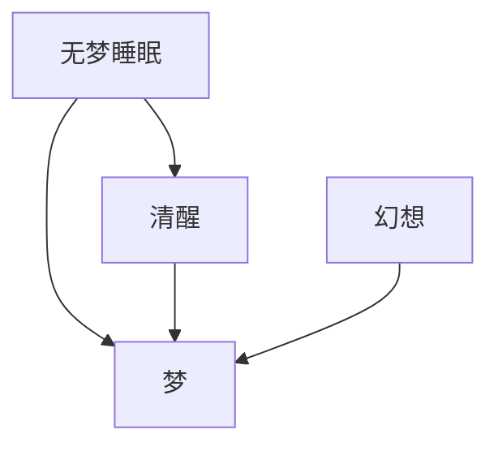

# Time in the Dream

## META

**创建日期**: 2021-02-03

**参考等级**: ⭐⭐

**关联**: [[The Routledge handbook of philosophy of temporal experience]]

**标签**: #时间; #时间体验; #梦

**引用**: Crowther, Thomas, and Matthew Soteriou. "Time in the Dream." Chap. 14 In *The Routledge Handbook of Philosophy of Temporal Experience*, edited by Ian Phillips, 184-200. New York: Routledge, 2017.

### 概述

「想象」模型来理解梦的体验，大部分都相同，只是使用的「现在」不是「事实上的真实的现在」

## 结构

### 总体结构

## 正文分析

### 总体上，时间体验具有的属性

1. 缺乏体验的状态（无梦睡眠）时，人是没有获得即时的标记（「时间点」）概念的。
2. 无梦睡眠时，缺乏对时间断（intervals of time，有间时间)的理解。

清醒者的意识：

1. 体验到变化和流逝
2. 体验到基于一个起源点产生的「具时态的时间视角」(tensed temporal perspective)

### 梦中的时间体验的属性

#### 梦的意识状态和清醒状态没有本质区别

主要争辩的证据：梦和清醒时候的幻想本质上是相同的

#### 总结--想象模型

1. 梦的体验本体论上和清醒的体验有关，因为，梦的体验也是流逝的
2. 梦中的对象具有即刻的广延，并且能被体验
3. 梦的体验具有「具时态的时间视角」

不过，在「非清醒梦」中，体验的现在是「被想象出来的」，缺少对真实存在的「现在」的觉察。

## 文摘

## 评论
