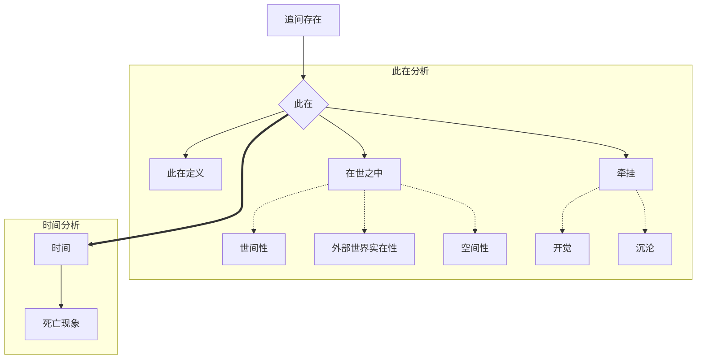

# 时间观念史导论

## Reference

标签: #时间 ; #海德格尔 ; #此在

* 海德格尔. 时间概念史导论. [Prolegomena Zur Geschichte Des Zeitbegriffs]. Translated by 欧东明. 海德格尔文集. Edited by 孙周兴 and 王庆杰. Vol. 20, 北京: 商务印书馆, 2014.

## 结构

### 总体结构

## 详细笔记与结构

### 2.32 基本的此在分析的成果与任务：厘定存在本身的问题

## 文摘

### 1. 自然的运动

> (pp. 503) 我们从空间上-时间上对其加以规定的自然的运动，并不是一种流逝「在时间中」（就像流逝于一个隧道「之中」那样）的运动，自然的运动本身全然是**脱离时间**的；只是自然的运动之存在被揭示为纯粹的自然，自然的运动就将仅仅只是在时间「之中」照面。

### 2. 此在定义时间

> (pp. 502 ~ 503) 在曾在的存在本身当中我无非就是此在的将来并与此同时也是此在的过去。此在（即先于-自身-存在）由之而能够原本地成为它的整体的那种存在，就是时间。

