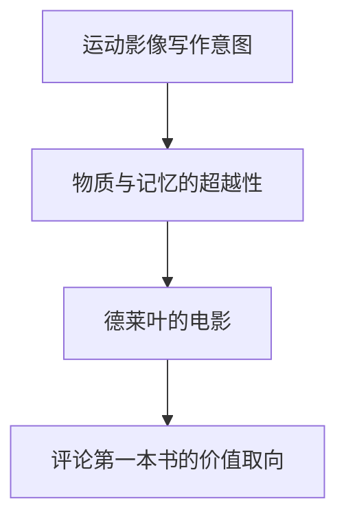

# 关于「运动-影像」

# META

**创建日期**: 2021-02-28

**参考等级**: ⭐⭐⭐⭐⭐

**关联**: 

**标签**: #德勒兹; #运动影像; #法国哲学; #电影理论

**引用**: 法]吉尔·德勒兹. "关于运动-影像." Translated by 刘汉全. Chap. 5 In *在哲学和艺术之间：德勒兹访谈录*, 62-76. 上海: 上海人民出版社, 2019.

## 概述

# 结构

## 总体结构

# 正文分析

## 评德莱叶

标签: #德莱叶

从德莱叶的科学理性与神性，德勒兹谈到法兰西学院派艺术和印象派的区别，并认为里维特是法兰西学院派的。

## 评战前电影

标签: #雷诺阿; #奥孙威尔斯

雷诺阿的戏剧-生活是「actual-virtual」影像。

最早的时间影像是威尔斯的，在那里不直接用运动表达时间。

## 评叙事

不是说「现代艺术电影」放弃了叙事，只是时间影像里，电影太美打破了感知过程，完全在光和声响中。空间在此断裂。

时间在与运动分离后，便和幻想、梦结合在一起。从看到工厂想到囚犯，这个不是不是线性延续，而是在真实-虚构之间循环。「actual-virtual」在这里重叠结晶。这个就是「晶体-影像」

时间(展示破坏意义结构)-识读(可读)-精神(与思想有关)。新的影像分类

## 语言学解读的问题

标签: #麦茨; #帕索里尼

电影是变奏。电影是可读。

## 评价希区柯克

标签: #希区柯克

希区柯克把观众带入影片之中。不是目光，而是一连串关系框住了动作。犯罪是被给与的。

# 文摘

## 《电影：运动-影像》的写作意图

标签: #皮尔士

> 从某种角度上说，这[《电影：运动-影像》]是一部电影史，但是一部「自然史」。(pp. 62)

> 每次都有一些内在的符号同时从这些影像的产生和构成这两个角度表现出它们的特点。(pp. 63)

> 皮尔士这样的逻辑学家的重要之举就是将极其丰富的符号进行了一种相对脱离语言模式的分类。... 在此意义上，我试图写一部逻辑的书，写出一种电影的逻辑。(pp. 63)

## 评论《物质与记忆》

标签: #伯格森

> 他[伯格森]不再将运动置于绵延一方，而死一方面提出影像物质运动的绝对同一性，另一方面又发现其为同时存在于一切绵延层面的同在的时间(物质仅是最低的层面)。(pp. 64)

> 在《物质与记忆》中，一种纯粹的唯精神主义与一种彻底的唯物主义喜结良缘。也可以说，这同是Vertov和德莱叶，同为两种方向。(pp. 65)

# 评论