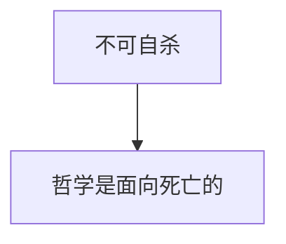

# 斐多(杨绛)

## META

**创建日期**: 2021-02-05

**参考等级**: ⭐⭐⭐⭐⭐🌕

**关联**: 

**标签**: #生死论; #死亡哲学; #死亡; #柏拉图; #杨绛

**引用**: [古希腊]柏拉图. *斐多: 柏拉图对话录之一*. Translated by 杨绛. Kindle ed. Edited by 冯金红. 北京: 生活·读书·新知·三联书店, 2015.

### 概述

## 结构

### 总体结构

## 正文分析

### 论证不可自杀

天神是我们的主子 → 主子不可允许自我了断

带来问题：为什么要离开天神？

### 论证哲学是关于死亡的

[哲学家不追求物质而追求精神] 

1. 肉体反倒具有欺骗性带来不实的感官
2. 肉体让我们无法体验绝对的真善美
3. 肉体会产生欲望冲突，成为烦恼

死亡可以解决这些问题

### 学习哲学的人应该不怕死

因为哲学就是练习死亡，如果怕死，说明他还是爱慕肉体荣华。

### 一般人勇敢来自恐惧，节制来自放纵

节制为了以后放纵（省钱以后花）

### 论证灵魂不朽

[万物都有相反处]  → [生死可以互相转化] → [有死必有其他地方生] → [轮回] → [灵魂不朽]

### 认识来来自记忆

标签: #回忆说

[认识的时候总是想起别的] | [我们知道两种东西是相等的，比如椅子是椅子，抽象和具象的东西有时候也被认为是相等的]  →  [认识来自记忆] → [记忆在生前就有] → [灵魂不朽]

## 文摘

### 1. 斐多见到苏格拉底死时候的总体体验

> 斐 多 　 我呀， 陪 他在 监狱 里 的 时候， 感情 很 特殊。 如果 我看 到 一个 朋友 要死 了， 我 心里 准是 悲伤 的， 可是 我 并不。 因为 瞧 他的 气度， 听他 的 说话， 他是 毫无 畏惧、 而且 心情 高尚 地 在 等死， 我 觉得 他是 快乐 的。 所以 我想， 他 即使是 到 亡灵 居住 的 那边 去， 一路上 也会 有天 神 呵护； 假如 那种 地方 也有 谁 会 觉得 好， 那么 他到 了 那里， 他的 境遇 一定 是 好的。 就为 这个 缘故， 我 并不 像 到了 丧事 场合、 自然而然 地 满怀 悲悯， 我没 有这 种 感觉。 不过 我也 并不能 感到 往常 听他 谈论 哲学 的 快乐， 而我 们 那天 却是 在谈 论 哲学。 我的 心情 非常 奇怪。 我想 到 苏格拉底 一会儿 就要 死了， 我 感到 的 是一 种 不同 寻常 的 悲喜交集。 (Kindle 位置 103-111).
>

### 2. 苏格拉底的梦以及哲学和音乐的关系

>我 屡次 在 梦里 听到 一个 督促 我的 声音， 叫我 作 作诗， 和 文艺 女神 结交。 我 生怕 疏忽 了 自己的 责任， 想知道 个 究竟。 我 且说 说 我的 梦 吧。 我 过去 常 做 同一 个梦。 梦 是 各式各样 的， 可是 说的 总是 同一 句话。 它 说：‘ 苏格拉底 啊， 创作 音乐！ 培育 音乐！’ 我 以前 呢， 以为 这是 督促 我、 鼓励 我 钻研 哲学。 我 生平 追随 的 就是 哲学， 而 哲学 是最 高尚、 最优 美的 音乐。(Kindle 位置 156-160). 

### 3. 哲学是关于死亡的

> “许多人 不懂 哲学。 真正 的 追求 哲学， 无非 是 学习 死， 学习 处于 死的 状态。 他 既然 一辈子 只是 学习 死、 学习 处于 死的 状态， 一旦 他 认真 学习 的 死 到了 眼前， 他 倒 烦恼 了， 这不 是 笑话 吗？” (Kindle 位置 246-248). 
>

### 4. 灵魂带着肉体理解智慧的后果

> “那么， 什么时候 灵魂 能 求得 真实 呢？ 因为 带着 肉体 去 探索 任何 事物， 灵魂 显然 是要 上当 的。” (Kindle 位置 285-286). 
>

### 5. 修行学哲学的人怕死就会有矛盾

> 我一 开头 就 说过， 假如 一个人 一辈子 一直 在 训练 自己， 活着 要 保持 死的 状态， 他 临死 却 又 苦恼 是 荒谬 的。 这不 是 荒谬 吗？”(Kindle 位置 350-351). 
>

> 西米 啊， 如果 你 看到 一个人 临死 愁苦， 就 足以 证明 他爱 的 不是 智慧， 而是 肉体， 也许 同时 也 爱 钱， 或是 权位， 也许 又 爱 钱 又 爱 权位。 (Kindle 位置 364-366). 
>

#### 6. 一般人的节制来自放纵

> “关于 节制， 不 也是 同样 情况 吗？ 他们的 自我 克制 是 出于 一种 自我 放纵。 当然， 这 话 听来 好像 不可能。 不过 他们 那 可笑 的 节制， 无非 因为 怕 错失 了 自己 贪图 的 享乐。 他们 放弃 某些 享乐， 因为 他们 贪图 着 另一种 享乐， 身不由己 呢。 一个 人为 享乐 而 身不由己， 就是 自我 放纵 啊。 他们 克制 了 某些 享乐， 因为 他们 贪图 着 另一 些 享乐， 身不由己。 我说 他们的 自我 节制 出于 自我 放纵， 就是 这个 意思。”(Kindle 位置 383-388). 
>

### 7. 认识来自于记忆

> 假如 一个人 曾经 听到、 看到 或者 由 别的 方式 认识 了 一件 东西， 他以 后 不但 认识 这一 种 东西， 还 附带 着 认识到 一些 不 相同 的 旁 的 东西。 我们 能不 能说， 他 认识到 的 就是 他 记起 来的。 能 这样 说 吗？” (Kindle 位置 525-528). 
>

### 8. 灵魂肉体与可见性的比喻

> 灵魂 和 看不见 的 东西 更 相像， 肉体 和 看得见 的 东西 更 相像。” (Kindle 位置 739-740)

### 9. 苏格拉底死时的场景

> 那人 说着 就把 杯子 交给 苏格拉底。 他 接过 了 杯子。 伊 奇 啊， 他 非常 安详， 手 也不 抖， 脸色 也 不变。 他 抬 眼 像 他 惯常 的 模样 大 睁着 眼看着 那人 说：“ 我想 倒出 一点 来 行 个 祭奠 礼， 行吗？” 那人 说：“ 苏格拉底， 我们 配制 的 毒药 只 够 你喝 的。” 苏格拉底 说：“ 我 懂。 不过 我总 该 向 天神 们 祈祷 一番， 求我 离开 人世 后 一切 幸运。 我 做 过 这 番 祷告 了， 希望 能够 如愿。” 他 说完 把 杯子 举 到 嘴边， 高高兴兴、 平平静静 地 干了 杯。 我们 大多数人 原先 还能 忍住 眼泪， 这时 看他 一 口口 地 喝， 把 毒药 喝 尽， 我们 再也 忍耐 不 住了。 我 不由自主， 眼泪 像 泉水 般 涌出 来。 我 只好 把 大氅 裹着 脸， 偷偷 地 哭。 (Kindle 位置 1716-1724). 
>

> 不过 阿 波 早先 就 一直 在 哭， 这时 伤心 得失 声 号哭， 害 得 我们 大家 都 撑 不 住了。 只有 苏格拉底 本人 不动声色。 他说：“ 你们 这 伙人 真 没 道理！ 这是 什么 行为 啊！ 我把 女人 都 打发 出去， 就为 了 不让 她们 做出 这等 荒谬 的 事 来。 因为 我 听说， 人 最好 是在 安静 中 死。 你们 要 安静， 要 勇敢。” 我们 听了 很 惭愧， 忙 制住 眼泪。 他 走着 走着， 后来 他说 腿 重 了， 就 脸 朝天 躺下， 因为 陪侍 着 他的 人 叫 他 这样 躺 的。 掌管 他 毒药 的 那人 双手 按着 他， 过 一会儿 又 观察 他的 脚 和 腿， 然后 又 使劲 捏 他的 脚， 问 有没有 感觉； 他说“ 没有”； 然 后又 捏 他的 大腿， 一路 捏 上去， 让我 们 知道 他 正 渐渐 僵 冷。 那人 再 又 摸摸 他， 说 冷 到 心脏， 他 就去 了。 这时候 他 已经 冷 到 肚子 和 大腿 交接 的 地方， 他把 已经 蒙上 的 脸 又 露出 来说（ 这是 他 临终 的 话）：“ 克里， 咱们 该 向 医药 神 祭 献 一只 公鸡。 去 买 一只， 别 疏忽。”  克里 说：“ 我们 会 照办 的， 还有 别的 吩咐 吗？” 他对 这一 问 没有 回答。 过 一会儿 他 动了 一下， 陪侍 他的 人 揭开 他 脸上 盖 的 东西， 他的 眼睛 已经 定了。 克里 看见 他 眼睛 定了， 就为 他 闭上 嘴、 闭上 眼睛。(Kindle 位置 1725-1738). 
>