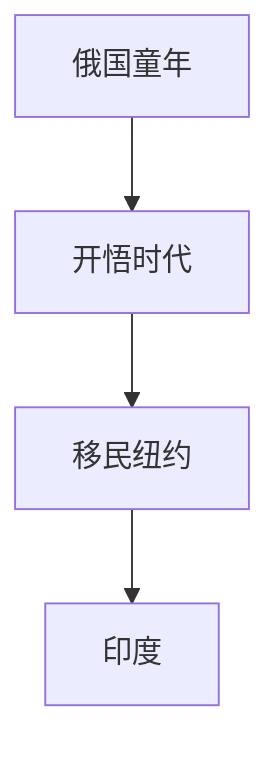

# Madame Blavatsky: The Woman Behind the Myth

# META

**创建日期**: 2021-03-31

**参考等级**: ⭐⭐

**关联**: 

**标签**: #2021-03-01; #布拉瓦茨基; #神智学; #神秘体验 

**引用**: Meade, Marion. *Madame Blavatsky: The Woman Behind the Myth*. New York: Open Road, 2001.

## 概述

# 结构

## 总体结构

# 正文分析

## 俄国三：画面和声音

## 开悟一：Ramsgate的印度教

# 文摘

# 评论
