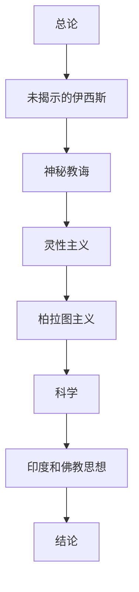

# Recycled Lives: A History of Reincarnation in Blavatsky's Theosophy

# META

**创建日期**: 2021-04-09

**参考等级**: ⭐⭐⭐

**关联**: 

**标签**: #2021-04-01; #神智学; #布拉瓦茨基; #轮回

**引用**: Chajes, Julie. *Recycled Lives: A History of Reincarnation in Blavatsky's Theosophy*. Oxford University Press, 2019.

## 概述

# 结构

## 总体结构

# 正文分析

## 第七章 印度教与佛教思想

# 文摘

# 评论

