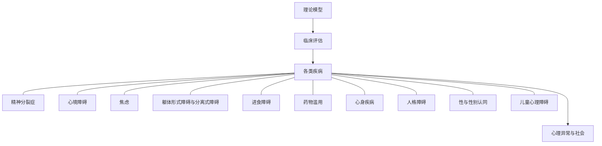

# 变态心理学(钱铭仪)

# META

**创建日期**: 2021-06-25

**参考等级**: ⭐⭐⭐

**关联**: 

**标签**: #2021-06-01; #变态心理学

**引用**: 

## 概述

# 结构

## 总体结构

```mermaid
graph TD

理论模型 --> 临床评估

临床评估 --> 各类疾病

各类疾病 --- 精神分裂症

各类疾病 --- 心境障碍

各类疾病 --- 焦虑

各类疾病 --- 躯体形式障碍与分离式障碍

各类疾病 --- 进食障碍

各类疾病 --- 药物滥用

各类疾病 --- 心身疾病

各类疾病 --- 人格障碍

各类疾病 --- 性与性别认同

各类疾病 --- 儿童心理障碍

各类疾病 ---> 心理异常与社会
```

# 正文分析

## 转换型障碍

标签: #转换性障碍; #癔症; #集体癔症

# 文摘

# 评论
