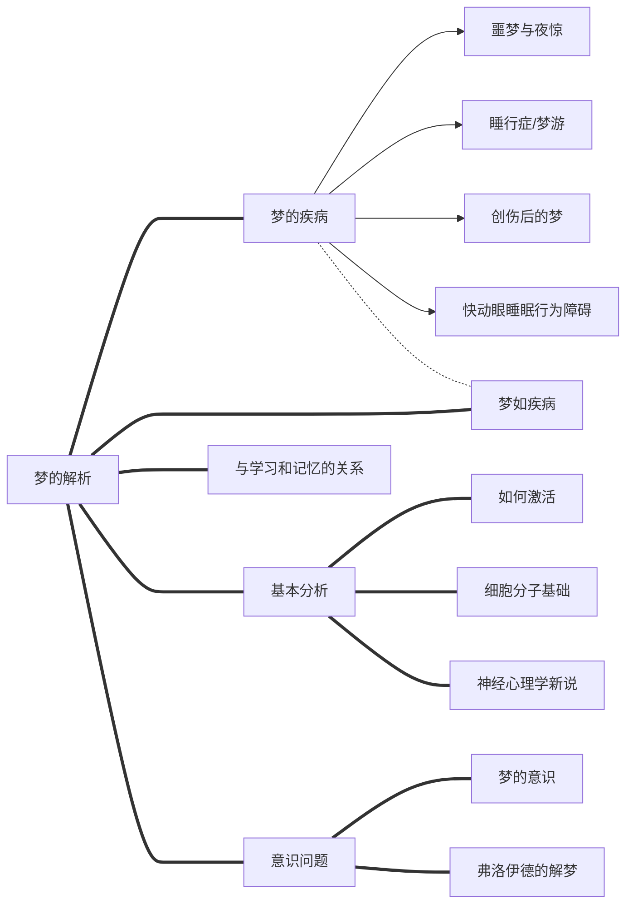

# 梦的新解

## Meta

**标签**: #梦的解析; #梦; #心理学; #神经科学; #弗洛伊德

**Reference**: J·艾伦·霍布森, [美]. *梦的新解*. [Dreaming]. Translated by 韩 芳. 百科通识文库. Vol. 49, 北京: 外语教学与研究出版社, 2015.

## 结构

## 分析

### 梦的内容分析为何没有成为一门科学？

#### 两种模式对梦的解读

 (Kindle 位置 247-248)

| 梦的现象     | 精神分析             | 激活-整合                 |
| ------------ | -------------------- | ------------------------- |
| 诱因（动机） | 被压抑的潜意识愿望   | 睡眠期间的大脑激活        |
| 视觉表象     | 退至感觉层面         | 高级视觉中枢激活          |
| 错觉         | 初级加工思维         | DLPFC失活导致工作记忆丧失 |
| 怪诞         | 愿望的伪装           | 超联想的整合              |
| 情感         | 对自我的次级防御反应 | 边缘系统的原发激活        |
| 遗忘         | 压抑                 | 器质性（生理性）失忆      |
| 意义         | 相当含糊不清         | 清晰，明显                |
| 解析         | 需要                 | 不需要                    |

### 睡眠状态下大脑是如何激活的

#### 人类的行为状态

 (Kindle 位置 481-483)

### 大脑做梦的细胞分子基础

#### 快严冬睡眠激发过程

### 人为什么会做梦

#### 睡眠剥夺与梦剥夺

1. 1960年代梦剥夺导致精神异常可能只是睡眠剥夺的假想
2. 老鼠睡眠剥夺后降低进食欲望，最后死亡；如果恢复睡眠，在前期可以回复

#### 梦的功能

- 欧文· 弗拉纳根（Owen Flanagan）认为梦是一种附带现象

- 情绪超关联，让情绪与认知记忆关联

### 梦、学习和记忆

#### 做梦提高表现

### 梦的意识

#### 梦对于意识的变化

 (Kindle位置1460)

| 意识组分 | 与清醒相比发生的变化                 | 大脑区域             |
| -------- | ------------------------------------ | -------------------- |
| 感觉     | 几乎完全是内源性激发                 | 外周感觉器官         |
| 知觉     | 几乎完全是内源性激发                 | 皮质和皮质下加工     |
| 注意力   | 被梦事件战局，难以支配               | 丘脑皮质             |
| 情感     | 夸张的喜悦、愤怒和焦虑               | 边缘皮质下（杏仁核） |
| 本能     | 常见的斗争并逃跑                     | 边缘皮质下（下丘脑） |
| 思维     | 非逻辑性的，不受控制的               | 额叶皮质             |
| 定向     | 时间、地点、人物（除自己外）严重缺乏 | 顶叶、额叶皮质       |
| 叙述     | 高度交谈性                           | 左颞叶皮质           |
| 意志     | 弱                                   | 前额叶皮质           |
| 动作     | 模拟的持续活跃                       | 脊髓、肌肉           |

