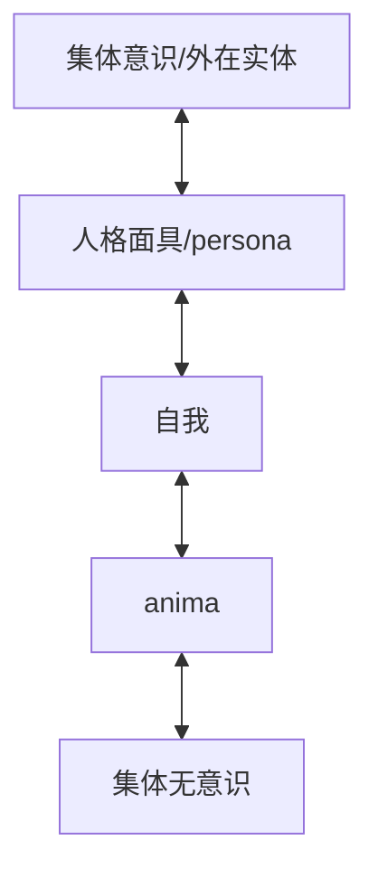

# [标题]

# META

**创建日期**: 2021-09-05

**参考等级**: ⭐⭐⭐⭐

**关联**: [[The Shadow from Handbook]]

**标签**: #2021-09-01; #荣格; #自性; #精神分析 

**引用**: Colman, Warren. "The Self." Chap. 7 In _The Handbook of Jungian Psychology: Theory, Practice and Applications_, edited by Renos K. Papadopoulos. London, New York: Routledge, 2006.

## 概述


# 结构

## 总体结构

```mermaid
graph TD

```

# 正文分析

## 第一部分：荣格

### 个体性(individuality)和反面的思考



### 曼荼罗和生命之池

* 开始尝试曼荼罗
* 就是要慢慢到中心，然后旋转

### 整体和中心

* 意识和无意识互相补偿
* 「自性」代表着最内心，最终，以及无补偿的单一性，它意味着变成自己

### 原型和符号

* 「自性」是无法体验的
* 原型通过符号可以给人经验性的线索

### 经验和概念

* 第一层是「自性」的，无法感知
* 第二层是现象学分析和自性的符号表征的分类
* 第三层是对绝对、智性的看法

### 神-图像(the God-image)

* 神是一个圆形，可以在精神(psyche)中是一个复写。
* 神和自性本身是有概念差异的

#### 基督教的神-图像

* 极度成为一个意识与潜意识的统一的象征，也是自我和自性的关系。
* 不过极度缺乏黑暗面，这些层面导致了20世纪前半段时间的暴力

### 自我和自性

## 列出所有的自性定义

* 个体性
* 意识与无意识的中点
* 对立面的统一
* 精神的整体
* 精神的中心
* 原型
* 整体性
* 组织好的原则


# 文摘

# 评论
