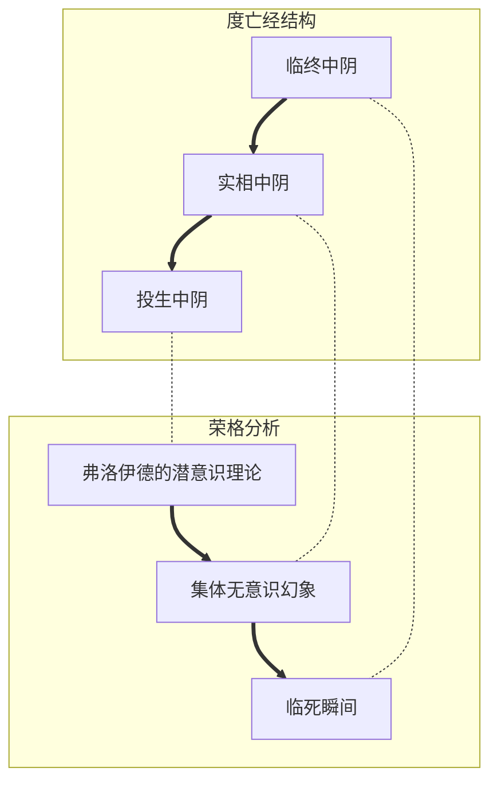

# 精神分析与灵魂治疗

## META

**引用**：[瑞士]卡尔·荣格. *分析心理学与灵魂治疗*. 荣格作品集. Kindle ed. 北京: 译林出版社, 2014.

## 文摘

### 1. 理智并非心理学

#理智非心理学

> 在 我们 这里， 得到 倾听、 解释、 辩论、 捍卫、 批评 的， 仅仅是 所有 那些 断言， 而 制造 这些 断言 的 权威， 却 并不 在 讨论 的 范围 之中。(Kindle 位置 18497-18498).

### 2. 度亡的意义

#度亡的意义

> 而言，《 中 阴 得 度》 正像 伊 文 斯- 温 茨 博士 感觉到 的 那样， 乃是 一种“ 开始” 的 仪式， 其 目的 是要 恢复 灵魂 在 投 生时 失 去的 神 性（ 佛 性）。 (Kindle 位置 18546-18547)」

### 3. 为何会投生

> 这种 治疗 采取 了 弗 洛 伊 德 精神 分析 学的 方式， 其 主要 的 关注 是 人的 性 幻想。 这种 关注， 正好 与“ 中 阴” 中 最后、 最低 的 境界（ 即 所说 的“ 投 生 中 阴”） 相应， 此时 的 死者， 由于 无法 从“ 临终 中 阴” 和“ 实 相中 阴” 的 澄 明 教诲 中 获益， 遂 成为 种种 性 幻想 争夺 的 猎物， 并 最终 着迷 于 男女 交媾 的 幻 相。 其 结果 便是 被 吸入 母体， 重新 投 生于 人世。(Kindle 位置 18553-18555)

### 4. 实相中阴的前行与如来幻想

> 从 相反 的 方向 穿越“ 实 相中 阴” 继续 上行， 我们 最终 见到 的 是 四位 至尊： 绿色 的 不 空 如来， 红色 的 阿 弥 陀 如来， 黄色 的 宝 生 如来， 白色 的 金刚 萨 埵。 上行 终止 于 佛陀 法 身 的 之实 相 法 界， 此时， 来 自大 日 如来 的 明亮 青 光 闪耀 于 曼 荼 罗 之 中央。(Kindle 位置 18671-18673)

### 5. 易经与巧合

> 中国 人的 心灵， 就我 在《 易经》 中 看见 的 那样， 似乎 完全 关注 着 事件 的 偶然。 我们 所谓 的“ 巧合”， 似乎 正是 这一 奇特 心灵 的 主要 关注 之所 在。 相反， 在 我们 这里 备受 尊崇 的 因果 法则， 却 几乎 完全 不为 他们 所 注意。(Kindle 位置 17797-17799)

### 6. 共时性因果的表述

> 在 中国人 心目中， 同时性 原则 也 处理 了 种种 事件 的 契 合 和 符 应。 因果 论 的 观点 把 一个 戏剧 性的 故事 告诉 我们： D 的 存在， 是 起源于 先 D 而 存在 的 C, C 则 来源于 在 它 之前 的 B。 与此 相应， 同时性 观点 则 试图 用 事件 的 契 合 制造 出 同样 有意义 的 情景。 它 试图 告诉 我们： A、 B、 C、 D 是 如何 同时 出现 在 同一时间、 同一 地点 的。(Kindle 位置 17825-17828)

## 结构

### 我怎样用《易经》占卜

#### 占卜与共时性因果

### 西藏的度亡经

## 分析

### 西藏的度亡经

**TAG**: #大乘佛学, #密宗, #藏传佛教, #西藏度亡经

#### 书的三部分

* 临终中阴（Chikhai Bardo）：死亡瞬间的样子
* 实相中阴（Chonyid Bardo）：死之后的梦幻状态
* 投生中阴（Sidpa Bardo）投生如何发挥作用，以及胎儿期的种种事件

#### 投生的原因

和弗洛伊德的性幻想类似，着迷于男女交媾。

![[#3 为何会投生]]

#### 批判弗洛伊德

- 弗洛伊德未超过「投生中阴」
- 如果以生物学理解意识，就没有办法理解「实相中阴」
- 「投生中阴」纠结于神经症

#### 实相中阴

- 「实相」是业力造成的幻觉
- 幻觉来自「前生」心理残余
- 业力可遗传 ---> 考虑与集体无意识的类同
- 心理因素的遗传不可单单归于家族和种族遗传，因此柏拉图称之为「形式」，类似一种气质，或者奥古斯丁说的「原型」
- 个人没有出生前的记忆，却有与生俱来的原型

#### 产生幻觉的方式

总体来说，需要「意识水平的降低」(abaissement du niveau mental)

昆 达 利 尼 瑜伽（ kundalini yoga）通过故意诱发精神病来看到「实相中阴」中的地狱酷刑。

「投生中阴」向「实相中阴过渡」其实是自觉意识的目标，一种危险的颠倒，是弗洛伊德ego的「焦虑之真实所在」

此时，需要「主体」投射一个「客体」，看到眼前的世界。

「实相中阴」是「思想之形式」显现为显示。

#### 临终中阴

最高的境界在死亡的瞬间而不是「中阴」的结尾。

此书的内容来自于「无意识原型」，即没有物质现实，也没有形而上的显示，只有心理的现实