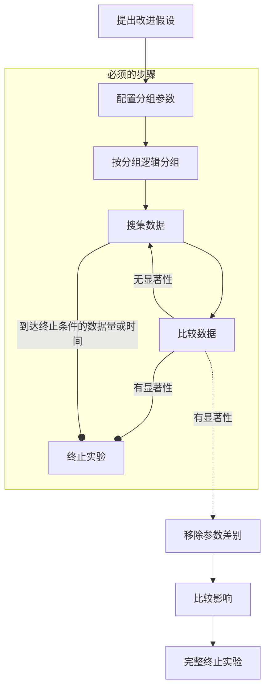

# AB测试

标签: #AB测试; #ABTest

## 分组测试与损失

* 测试本身意味着损失，因为它要求起码一半的数据在低效的配置/页面设计下

* 其次还有单独为AB测试开辟的系统
* 推荐系统里，一些杂音的展示意味着业务的损失

## 分组测试的过程

```mermaid
graph TD

提出改进假设 --> 配置分组参数

subgraph 必须的步骤
配置分组参数 --> 按分组逻辑分组 --> 搜集数据 ---> 比较数据 --无显著性--> 搜集数据
比较数据 ---o|有显著性| 终止实验
搜集数据 --到达终止条件的数据量或时间--o 终止实验
end

比较数据 -...->|有显著性| 移除参数差别 --> 比较影响 --> 完整终止实验


```

