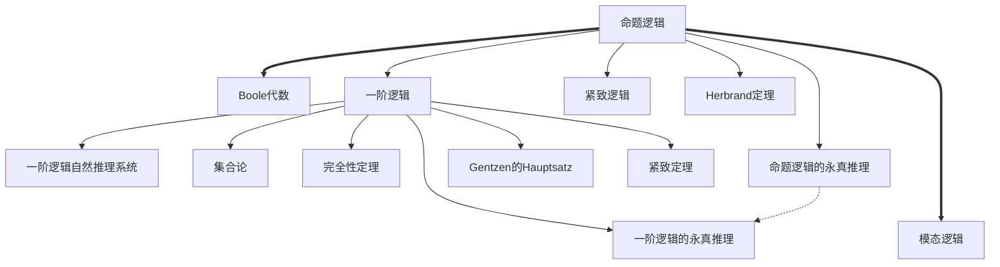

# 数理逻辑十二讲

## Reference

宋方敏, and 吴骏. 数理逻辑十二讲. 面向cs2013计算机专业规划教程. 北京: 机械工业出版社, 2017.

## 结构

### 总体结构

## 详细内容

### 命题逻辑

**字母表**： 命题符$P_n$，即$PS = \{P_n | n \in N\}$；联结词$\land \lor \lnot \to$；辅助词$(,)$

**命题**：$PS$；$A$，$B$为命题则$\lnot A$, $(A \land B)$, $(A \lor B)$, $(A \to B)$为命题；命题就这些。

#### 自然推演系统

### 命题逻辑的永真脱离系统

#### 公理

1. A01 $A \to A$
2. A02 $(A \to (B \to C)) \to (B \to (A \to C))$
3. A03 $(A \to B) \to ((B \to C)\to (A \to C))$
4. A04 $(A \to (A \to B)) \to (A \to B)$
5. A05 $(A \to \lnot B) \to (B \to \lnot A)$
6. A06 $(\lnot\lnot A) \to A$
7. A07 $(A \land B) \to A$
8. A08 $(A \land B) \to B$
9. A09 $A \to (B \to (A \land B))$
10. A10 $A \to (A \lor B)$
11. A11 $B \to (A \lor B)$
12. A12 $(A \to C) -> ((B \to C) \to ((A \lor B) \to C))$

**MP**(分离规则)：$\frac{A \to B \quad A}{B}$

