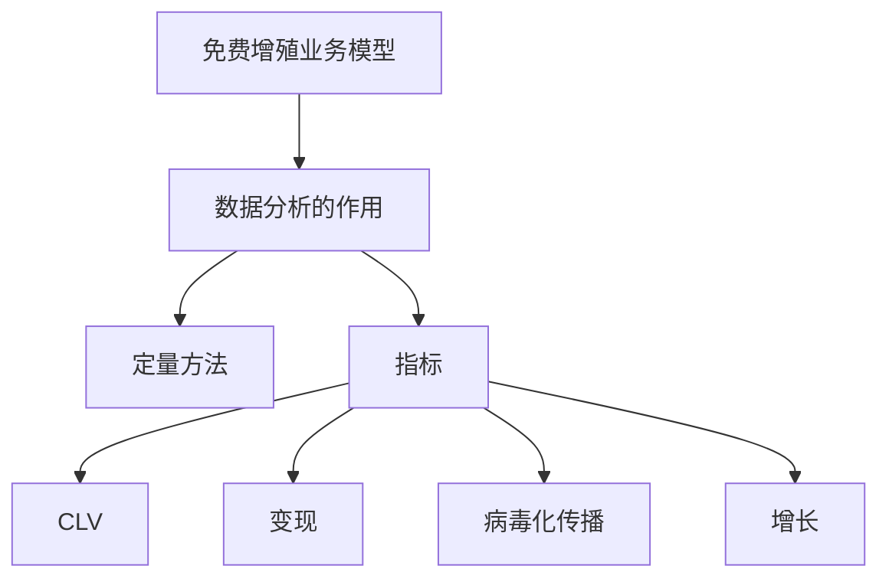
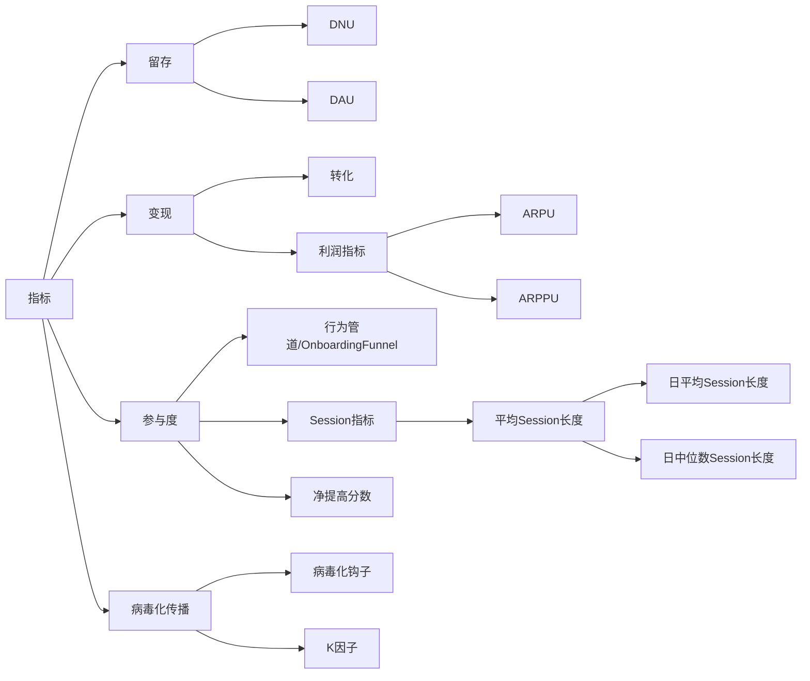

# Freemium Economics

## META

**创建日期**: 2021-01-21

**参考等级**: ⭐⭐⭐⭐

**关联**: 

**标签**: #数据分析; #免费增殖服务

**引用**: Seufert, Eric Benjamin. Freemium Economics: Leveraging Analytics and User Segmentation to Drive Revenue. Elsevier, 2013.

### 概述

## 结构

### 总体结构

### 指标

## 正文分析

### 免费增殖业务模型

##### 模型的要素

* 收费为0来获取最大数量的用户
* 这样就建立了一个用户阻隔，让不会使用的用户隔绝开来
* 如果产品对用户吸引人，这样就有机会展示可以重复的购买行为。最后超过免费运营的开支。

## 文摘

## 评论

### 增长

#### 增长的策略

标签: #业务增长策略

* 人口学定向
* 优化路径
* 优化产品复制
* 收费用户获取
* 广告交易
* 需求端平台
* 供应端平台

