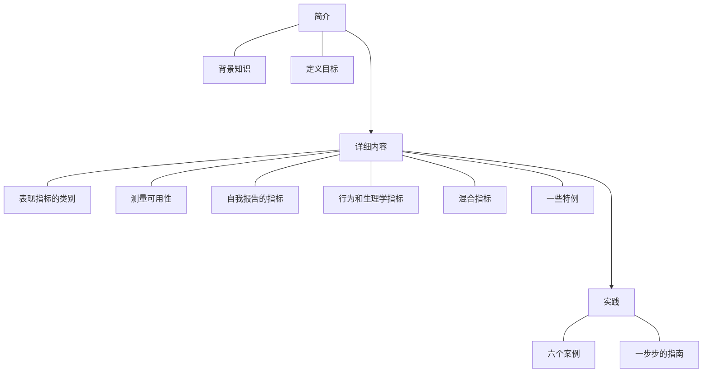

# Measuring the User Experience

# META

**创建日期**: 2021-03-29

**参考等级**: ⭐⭐⭐⭐⭐

**关联**: 

**标签**: #2021-03-01; #KPI; #用户体验

**引用**: Albert, William, and Thomas Tullis. *Measuring the User Experience: Collecting, Analyzing, and Presenting Usability Metrics*. Newnes, 2013.

## 概述

# 结构

## 总体结构

# 正文分析

## 简介

### 迷思

* 指标需要大量时间收集
* 可用性指标会花费大量金钱
* 可用性指标对小的进步没啥用
* 可用性指标不能帮助我们了解原因
* 可用性数据噪音太多
* 可以相信自己的勇气
* 指标不可以用到新产品上
* 指标没法被管理者更好的理解
* 在数据量很小的前提下，没法搜集足够确信的数据

## 背景

### 2.1 设计实验

#### 2.1.1 选择参与者

类型：

* 一些领域专家
* 

# 文摘

# 评论
