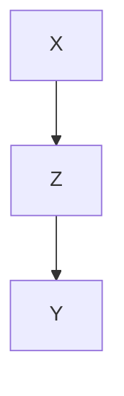
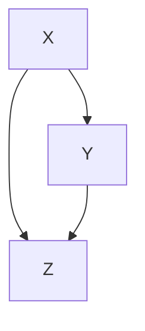
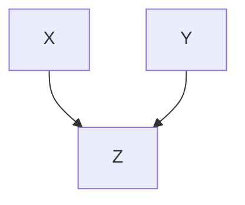
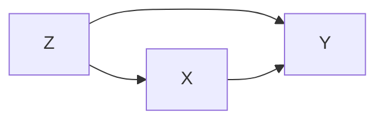

# 统计因果推理入门

# META

**创建日期**: 2021-03-26

**参考等级**: ⭐⭐⭐

**关联**: 

**标签**: #2021-03-01; #因果推理; #统计学 

**引用**: Pearl, Judea, Madelyn Glymour, and Nicholas P. Jewell. *统计因果推理入门*. [*Causal Inference in Statistics: A Primer*]. Translated by 杨矫云, 安宁 and 李廉. 北京: 高等教育出版社, 2020.

## 概述


# 结构

## 总体结构

```mermaid
graph TD

```

# 正文分析

## 绪言

### 1.5 结构因果模型

#### 1.5.1 因果假设模型

标签: #结构因果模型

结构因果模型(Structural Causal Model, SCM)可以概括为包含两个变量集$U$和$V$，以及一组函数，
$$
f = \{f_x: W_x \rightarrow X | X \in V\}
$$
其中$W_x \subseteq (U \cup V) - {X}$，即函数$f_x$根据模型中其他变量给$X$赋值。如果$Y$在$f_x$的定义域中，则，变量$Y$是变量$X$的直接原因。若$Y$是$X$的直接原因或者原因的原因，则$Y$是$X$的原因。

$U$表示外生原因，他们属于模型的外部，不必解释变化的原因。$V$为内生变量，至少是一个外生变量的后代。

## 图模型及其应用

### 2.2 链结构和分叉结构

**规则2.2.1(链结构中的条件独立性)** 如果变量$X$和$Y$之间只有一条单向路径，$Z$是截断这条路径的任何一组变量，则在$Z$的条件下，$X$和$Y$是独立的。




**规则2.2.2(分叉结构的条件独立性)** 如果变量$X$是变量$Y$和$Z$的共同原因，并且$Y$和$Z$之间只有一条路径，则$Y$和$Z$在$X$的条件下独立。



### 2.3 对撞结构

**规则2.3.1(对撞结构中的条件独立性)** 如果变量$Z$是变量$X$和$Y$之间的对撞节点，并且$X$和$Y$之间只有一条路径，那么$X$与$Y$是无条件独立的，但是在$Z$或$Z$的任何子条件下是相互依赖的。



### 2.4 d-分离

标签: #d-分离

**d-分离定义** 一条路径会被一组节点$Z$阻断，当且仅当：

1. 路径$p$包含链结构$A \rightarrow B \rightarrow C$或分叉结构$A \leftarrow B \rightarrow C$，且中间节点$B$在$Z$中（即以$B$为条件）；或者
2. 路径$p$包含一个对撞结构$A \rightarrow B \leftarrow C$，且对撞节点$B$及其子节点都不在$Z$中

### 2.5 模型检验与因果搜索


## 干预的效果

### 3.1 干预

干预的目的：

* 因为相关性不等于因果性，所以必须要做随机实验
* 有些实验无法随机，譬如「冰淇淋销量和犯罪率的没有关系，主要和天气有关」
* 人工干预删除部分条件，譬如「关闭所有冰淇淋」

使用符号$do$，譬如冰淇淋销量$X$，犯罪率$Y$和天气$Z$在上述条件中可以表述为
$$
P(Y=y| do(X=x, Z=z)) 
$$

### 3.2 校正公式

标签: #ACE

考虑下面的例子，其中$X$表示使用某种药物，$Y$代表痊愈， $Z$代表性别



然后我们可以计算如下式子
$$
P(Y = 1 | do(X = 1)) - P(Y = 1 | do(X = 0))
$$
该差异表示未「因果效应差异」(ACE, Average Causal Effect)或「平均因果效应」。当然$X$可以是多个取值，此事就要计算任意两个的差异。

$$
P(Y = y | do(X = x)) = \sum_z P(Y = y | X = x, Z = z)P(Z = z)
$$
以上称为，校正公式。这个过程叫对$Z$的校正。

应用于辛普森悖论，记$X = 1$为患者用药，$Z = 1$表示男性患者，$Y = 1$表示痊愈，则
$$
\begin{align}
P(Y = 1 | do(X = 1)) & = P(Y = 1 | X = 1, Z = 1) P(Z = 1) +\\
					 & = P(Y = 1 | X = 1, Z = 0) P(z = 0)
\end{align}
$$
这样，在计算$ACE$即可
$$
ACE = P(Y = 1 | do(X = 1)) - P(Y = 1 | do(X = 0))
$$

#### 3.2.1 校正还是不校正

**规则 3.2.1 (因果效应规则)** 给定一个图$G$，设变量$X$的父节点几何为$PA$，则$X$对$Y$的因果效应为
$$
P(Y = y | do(X = x)) = \sum_z p(Y = y | X = x, PA = z) P(PA = z)
$$

#### 3.2.2 多重干预和截断乘积规则

### 3.3 后门准则

标签: #后门准则

**定义3.3.1 （后门准则）**给定有向无环图中的一堆有序变量$(X, Y)$，如果变量集合$Z$满足：$Z$中没有$X$的后代节点，且$Z$阻断了$X$的后代节点，且$Z$阻断了$X$与$Y$之间的每条含有指向$X$的路径，则称$Z$满足关于$(X, Y)$的后门准则。

如果集合$Z$满足$(X, Y)$的后门准则，那么$X$与$Y$的应该效应可以由以下公式计算：
$$
P(Y = y| do(X = x)) = \sum_z P(Y = y | X = x, Z = z) P(Z = z)
$$

### 3.4 前门准则

标签: #前门准则

**定义 3.4.1（前门准则）** 变量集合$Z$被称为满足关于有序变量对$(X, Y)$的前门准则，如果:

1. $Z$切断了所有$X$到$Y$的有向路径；
2. $X$到$Z$没有后门路径；
3. 所有$Z$到$Y$的后门路径都被$X$阻断。

**定理 3.4.1（前门校正）** 如果$Z$满足变量$(X, Y)$的前门准则，且$P(x, z) > 0$，那么$X$对$Y$的因果效应是可识别的，由下面的式子计算：
$$
P(Y = y| do(x)) = \sum_z P(z | x) \sum_z P(y| x', z)P(x')
$$

### 3.5 条件干预和特定变量效应


## 反事实及其应用


# 文摘

# 评论

