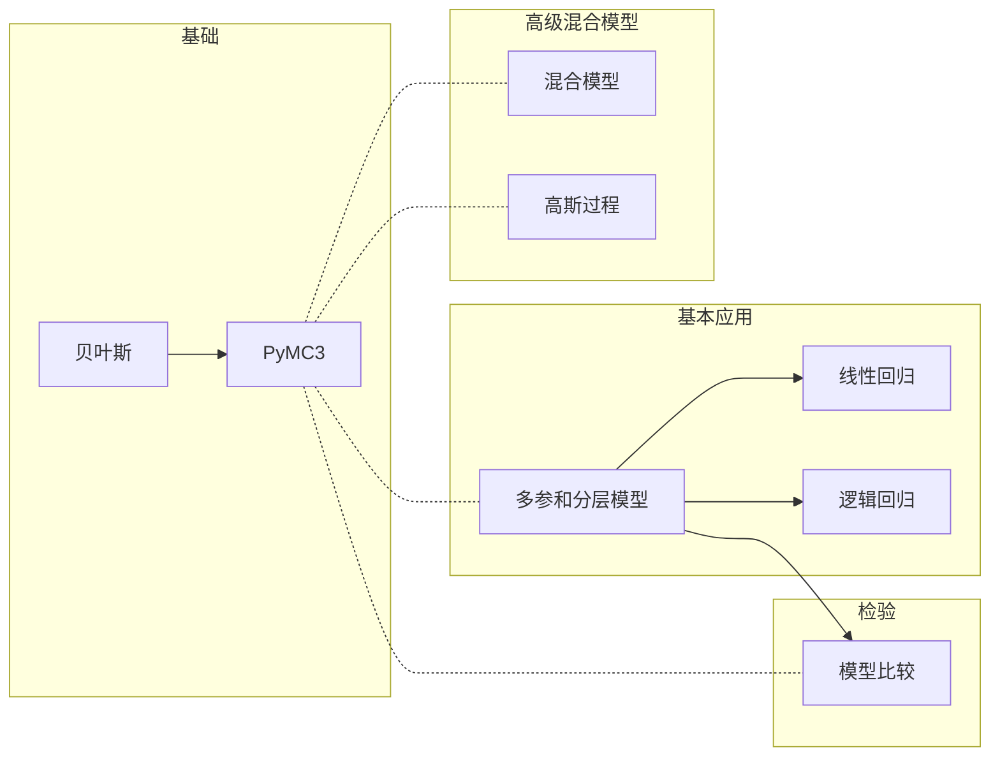

# Python贝叶斯分析

## Meta

**关联**：[[贝叶斯方法]]

**标签**： #贝叶斯;

**引用**：[阿根廷]奥斯瓦尔多·马丁. *Python贝叶斯分析*. [*Bayesian Analysis with Python*]. Translated by 田俊. 北京: 人民邮电出版社, 2018.

## 结构

### 总体结构



## 详细笔记

### 多参和分层模型

#### 组间比较

标签: #假设检验

##### Cohen's d

$$
\frac{\mu_1 - \mu_2}{\sqrt{\frac{\sigma_1^2 + \sigma_2^2}{2}}}
$$

##### 概率优势

$$
ps = \phi(\frac{\delta}{\sqrt{2}})
$$

### 线性回归

#### 概率假设

$$
y \sim N(\mu = \alpha + \beta X, \sigma = \epsilon)
$$

$$
\alpha \sim N(\mu_{\alpha}, \sigma_{\alpha})
$$

$$
\beta \sim N(\mu_{\beta}, \sigma_{\beta})
$$

$$
\epsilon \sim U(0, h_s)
$$

#### 改进

1. Metropolis采样改为NUTS采样
2. 使用StudentT回归

#### `glm`模块

```python
with Model() as model:
    glm.glm('y ~ x', data)
    trace = sample(2000)
```

### 逻辑回归

#### 基本假设

$$
logistic(z) = \frac{1}{1 + exp(-z)}
$$

$$
\theta = logsitic(\alpha + \beta X)
$$

$$
y \sim Bern(\theta)
$$

$$
\alpha \sim Norm(\mu_{\alpha}, \sigma_{\alpha})
$$

$$
\beta \sim Norm(0, \sigma_{\beta})
$$

#### 一些改进

$$
\beta \sim Studennt\, t(0, v, s)
$$


### 模型比较

#### 信息量准则

标签: #信息量准则

**赤池信息量准则**(Akaike Information Criterion, AIC)：有问题，属于非贝叶斯
$$
AIC = -2log\,p(y|\hat{\theta_{mle}}) + 2p_{aic}
$$
**偏差信息量准则**(Deviance Information Criterion, DIC)
$$
DIC = -2log\,p(y|\hat{\theta_{post}}) + 2p_{dic}
$$
**通用信息量准则**(Widely Available Information Criterion, WAIC):

#### 贝叶斯因子

贝叶斯模型可以转化如下：
$$
p(\theta | y) = \frac{p(y|\theta)p(\theta)}{p(y)}
$$

$$
p(\theta | y, M) = \frac{p(y|\theta, M)p(\theta | M)}{p(y | M)}
$$

这样，可以讲证据表示如下：
$$
p(y, M) = \int p(y | \theta, M)p(\theta| M) d\theta_m
$$

$$
BF = \frac{p(y|M_0)}{p(y|M1)}
$$

大致判断，当$BF >1$，$M_0$比$M_1$要好；1-3微弱，3-10中等，10-30强，30-100很强，100以上非常强

