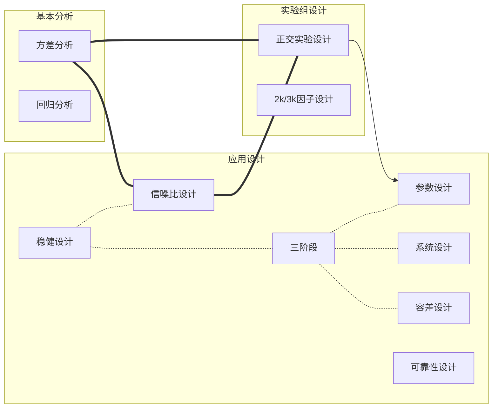
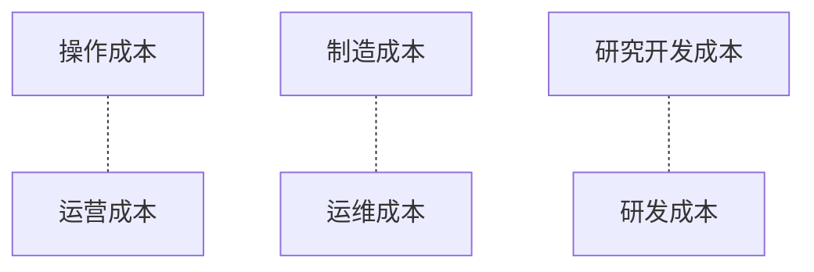

# 试验设计与分析

[toc]

## Meta

**关联**: 

**标签**: #试验设计; #统计学; #AB测试

**引用**： 陈魁. *试验设计与分析*. 北京: 清华大学出版社, 2005

## 结构

## 概述笔记

### 稳健设计

#### 主要成本

* 操作成本(Operation Cost)
* 制造成本(Manufacturing Cost)
* 研究开发成本（Research and Development Cost）

#### 公差与容差

$\Delta$(公差)与$2\Delta$(容差6) 

#### 影响质量特征的因子

1. 信号因子：指定产品灵敏度预期值的因子
2. 噪音因子：影响产品性能的因子
   * 外部环境
   * 产品非同一性
   * 恶化

#### 质量损失函数

1. 基本损失函数: $L(y) = K(y - m)^2 = \frac{A_0}{\Delta _0 ^ 2}(y - m)^2$
2. 单边二次损失函数：$L(y) = Ky^2, y \ge 0$
3. 非对称型二次质量损失函数：$$L(y) = \begin{cases}
   K_1(y - m)^2,  & y > m \\
   K_2(y - m)^2, & y \le m
   \end{cases}$$
4. 负二次型质量损失函数：$$L(y) = K(\frac{1}{y^2}) = A_0\Delta_0^2(\frac{1}{y^2}), y > 0$$
5. 阶梯型质量损失函数：$$L(y) = \begin{cases} 0, & \text{if } |y - m| \le \Delta_0 \\ A_0,  &\text{otherwise} \end{cases}$$

#### 质量设计三阶段

* 系统设计（System Design）: 即设计系统
* 参数设计（Parameter Design）： 通过正交设计实验数据分析来核定参数
* 容差设计（Tolerance Design）：找到影响各因素的重要性的内容，然后给予参数合理的容差范围

#### 信噪比

信噪比定义：

$$\eta = \frac{\text{信号功率}}{\text{噪声功率}} = \frac{S}{N}$$

常见的方式：

1. 测试时。$\eta = {\mu^2}/{\sigma^2}$
2. 稳定性。$\eta = 1 / V_E$，其中$V_E$是误差方差。

### 可靠性设计

#### 可靠度与故障率

$$R + F = 1$$

#### 原件组合模式

##### 串联方式

$$\begin{align}R_s & = P(E_1 \cap E_2 \cap E_3 \cap ... \cap E_n)\\ & = P(E_1)P(E_2)...P(E_n)\\ & = R_1R_2...R_n = \Pi^n_{i=1}R_i\end{align}$$

##### 并联方式

$F_s = P(\bar{E_1} \cap \bar{E_2} \cap ... \cap \bar{E_n})$

$$R_s = 1 - \Pi_{i=1}^n(1 - R_i)$$

##### 先并联再串联

$$R_s = [1 - (1 - R)^m]^n$$

##### 先串联再并联

$$R_s = 1 - (1 - R^n)^m$$

##### 可靠性分布

1. 指数分布

$$
f(t) = \begin{cases}
\lambda e^{-\lambda t}, & t \ge 0,\\
0, & t <0, 
\end{cases} \lambda > 0
$$

2. 正态分布
3. 韦布尔(Weibull)分布

$$
f(t) = \frac{\beta(t - \delta)^{\beta - 1}}{\theta^{\beta}}
exp[-(\frac{t - \delta}{\theta})^{\beta}],
t \ge \delta \ge 0, \beta \ge 0, \theta > 0
$$

$$
F(t) = \int_0^t f(\tau)d\tau = 1 - exp[-(\frac{t - \delta}{\theta})^{\beta}]
$$

$$
R(t) = 1 - F(t) = exp[-(\frac{t - \delta}{\theta})^{\beta}]
$$

## 文摘

## 评论

### 1. 成本类比

标签: #工程成本比较

