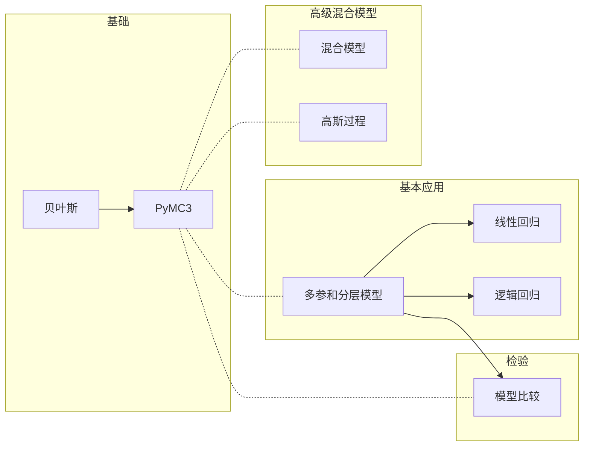

# Python贝叶斯分析

## Meta

**关联**：[[贝叶斯方法]]

**标签**： #贝叶斯; #数据分析;

**引用**：[阿根廷]奥斯瓦尔多·马丁. *Python贝叶斯分析*. [*Bayesian Analysis with Python*]. Translated by 田俊. 北京: 人民邮电出版社, 2018.

## 结构

### 总体结构



## 详细笔记

### PyMC3简介

#### 常用的推断引擎

标签: #贝叶斯训练方法; #贝叶斯推断引擎

* 非马尔科夫方法
  * 网格计算
  * 二次近似
  * 变分方法
* 马尔科夫方法
  * Metropolis-Hastings算法
  * 哈密尔顿蒙特卡洛方法（Hamiltonian Monte Carlo）/ 不掉向采样（No U-Turn Sampler, NUTS）

##### Metropolis-Hasting算法

标签: #Metropolis-Hasting

目的：生成任意分布的数据，$Q$表示临近的核取样点。

算法步骤：

1. 给参数$x_i$赋一个初始值，通常是随机初始化或者使用某些经验值。

2. 从某个简单的分布$Q(x_{i+1}|x_i)$中选一个新的值$x_{i+1}$，如高斯分布或者均匀分布。这一步可以看做对状态$x_{i}$的扰动。

3. 根据Metropolis-Hastings准则计算接受一个新的参数值的概率：
   $$
   p_a(x_{i+1}| x_i) = min \biggl(1, \frac{p(x_{i+1})q(x_i|x_{i+1}))}{p(x_i)q(x_{i+1}| x_{i})}\biggl)
   $$

4. 从位于区间$[0, 1]$内的均匀分布中随机选一个值，如果步骤3的概率值比这个大，则接受新的值，否则保持原来的值。

5. 回到第二步重新迭代。

注意点：

* 如果选取的分布$Q$是对称的，那么可以得到$p_a(x_{i+1}|x_i) = min\biggl( 1, \frac{p(x_{i+1})}{p(x_i)}\biggl)$
* 步骤三和四表示我们总是会比当前状态得到更大的状态。
* 我们只记录接受的样本。

##### NUTS

标签: #NUTS

#### 收敛性

##### 收敛性查看方法

标签: #PyMC3收敛性

* 查看核密度图：`pm.traceplot()`
* 查看折线图是否为白噪音：`pm.traceplot()`
* **Gelman-Rubin**检验：`pm.gelman_rubin(trace)`，**MC Error**要类似
* 自相关：`pm.autocorrplot(chain)`
* 有效采样大小：`pm.effective_n(multi_chain)`

#### 后验决策

* 检查KDE分布：`pm.plot_posterior(chain, kde_plot=True)`
* ROPE：`pm.plot_posterior(chain, rope=[0.45, 0.55])`
* 查看固定值所在的区间范围：`pm.plot_posterior(chain, ref_val=0.5)`

### 多参和分层模型

#### 组间比较

标签: #假设检验

##### Cohen's d

$$
\frac{\mu_1 - \mu_2}{\sqrt{\frac{\sigma_1^2 + \sigma_2^2}{2}}}
$$

##### 概率优势

$$
ps = \phi(\frac{\delta}{\sqrt{2}})
$$

### 线性回归

#### 概率假设

$$
y \sim N(\mu = \alpha + \beta X, \sigma = \epsilon)
$$

$$
\alpha \sim N(\mu_{\alpha}, \sigma_{\alpha})
$$

$$
\beta \sim N(\mu_{\beta}, \sigma_{\beta})
$$

$$
\epsilon \sim U(0, h_s)
$$

#### 高自相关解决方法

* 去中心化：
  $$
  x' = \frac{x - \bar{x}}{x_{sd}}
  $$

* 更换采样方法：NUTS比Metropolis-Hastings更好用

#### 后验可视化

* 使用模型不同$\mu$值绘制
* 使用标准模型的不同预测值。

#### 改进

1. Metropolis采样改为NUTS采样
2. 使用StudentT回归
3. 增加相互作用
4. 使用先验来排除共线性

#### `glm`模块

```python
with Model() as model:
    glm.glm('y ~ x', data)
    trace = sample(2000)
```


### 逻辑回归

#### 基本假设

$$
logistic(z) = \frac{1}{1 + exp(-z)}
$$

$$
\theta = logsitic(\alpha + \beta X)
$$

$$
y \sim Bern(\theta)
$$

$$
\alpha \sim Norm(\mu_{\alpha}, \sigma_{\alpha})
$$

$$
\beta \sim Norm(0, \sigma_{\beta})
$$

#### 一些改进

$$
\beta \sim Studennt\, t(0, v, s)
$$


### 模型比较

#### 信息量准则

标签: #信息量准则

**赤池信息量准则**(Akaike Information Criterion, AIC)：有问题，属于非贝叶斯
$$
AIC = -2log\,p(y|\hat{\theta_{mle}}) + 2p_{aic}
$$
**偏差信息量准则**(Deviance Information Criterion, DIC)

```python
pm.dic(trace=trace, model=model)
```


$$
DIC = -2log\,p(y|\hat{\theta_{post}}) + 2p_{dic}
$$
**通用信息量准则**(Widely Available Information Criterion, WAIC):

```
pm.waic(trace=trace, model=model)
pm.loo(trace=trace, model=model)
```


$$
WAIC = 2lppdf + 2p_{waic} \approx 2\sum log\biggl(\frac{1}{S} \sum p(y_i|\theta^s) \biggl)
$$


#### 贝叶斯因子

标签： #贝叶斯因子

贝叶斯模型可以转化如下：
$$
p(\theta | y) = \frac{p(y|\theta)p(\theta)}{p(y)}
$$

$$
p(\theta | y, M) = \frac{p(y|\theta, M)p(\theta | M)}{p(y | M)}
$$

这样，可以讲证据表示如下：
$$
p(y, M) = \int p(y | \theta, M)p(\theta| M) d\theta_m
$$

$$
BF = \frac{p(y|M_0)}{p(y|M1)}
$$

大致判断，当$BF >1$，$M_0$比$M_1$要好；1-3微弱，3-10中等，10-30强，30-100很强，100以上非常强

### 高斯过程

#### 高斯核函数

标签: #高斯核函数
$$
K(x, x') = exp \biggl( -\frac{||x - x'||^2 }{w} \biggl)
$$

#### 核线性回归

标签: #核线性回归

常规线性回归：
$$
y = f(x) + \epsilon
$$
可以表示为：
$$
f(x) = \mu = \sum^n_i \gamma x
$$
而多项式回归则可以表示为:
$$
\mu = \sum \gamma_i \phi_i (x)
$$
 其中，$\phi$表是多项式的项

推导为高斯核为：
$$
\mu = \sum^N_i \gamma_i K_i(x, x')
$$
 此时，$x$为我们的数据点为向量，而$x'$为增加的结或者中心点也为向量，均匀地分布在我们的数据范围内。

特例：我们可以假设$w$为1，则显然，$x_i = x'_i$时，$K(x_i, x_i') = 1$，同理，$x_i$与$x_i'$距离很大，$K(x_i, x_i') = 0$

```python
def gauss_kernel(x, n_knots=5, w=2):
  knots = np.linspace(
    np.floor(x.min()),
    np.ceil(x.max()),
    n_knots
	)
  return np.array([np.exp(-(x-k)**2/w) for k in knots])
  
```

模型简介：
$$
\gamma \sim Cauchy(\alpha = 0, \beta = 1)\\
\sigma \sim Uniform(0, 10)\\
\mu \sim \gamma K(x)\\
y = \mu + \sigma
$$

#### 高斯过程

##### 高斯过程定义

标签: #高斯过程
$$
f(x) \sim GP(\mu(x), K(x, x')) \\
p(y | x, f(x)) \sim N(f, \sigma ^2 I) \\
p(f(x)| x, y) \sim GP(\mu_{post}, \Sigma_{post})
$$

```python
with pm.Model() as GP:
    mu = np.zeros(N)
    eta = pm.HalfCauchy('eta', 5)
    rho = pm.HalfCauchy('rho', 5)
    sigma = pm.HalfCauchy('sigma', 5)
    
    D = squared_distance(x, x)
    K = tt.fill_diagonal(eta * pm.math.exp(-rho*D), eta + sigma)
    obs = pm.MvNormal('obs', mu, tt.nlinalg.matrix_inverse(K), observed=y)
    
    test_points = np.linspace(0, 10, 100)
    D_pred = squared_distance(test_points, test_points)
    D_off_diag = squared_distance(x, test_points)
    
    K_oo = eta * pm.math.exp(-rho * D_pred)
    K_o = eta * pm.math.exp(-rho * D_off_diag)
    mu_post = pm.Deterministic('mu_post', pm.math.dot(pm.math.dot(K_o, tt.nlinalg.matrix_inverse(K)), y))
    SIGMA_post = pm.Deterministic('SIGMA_post', K_oo = pm.math.dot(pn.math.dot(K_o, tt.nlialg.matrix_inverse(K)), K_o.T))
    
    start = pm.find_MAP()
    trace = pm.sample(1000, start=start)
    
varnames = ['eta', 'rho', 'sigma']
chain = trace[100:]
pm.traceplot(chain, varnames)

pm.df_summary(chain, varnames).round(4)
```

2