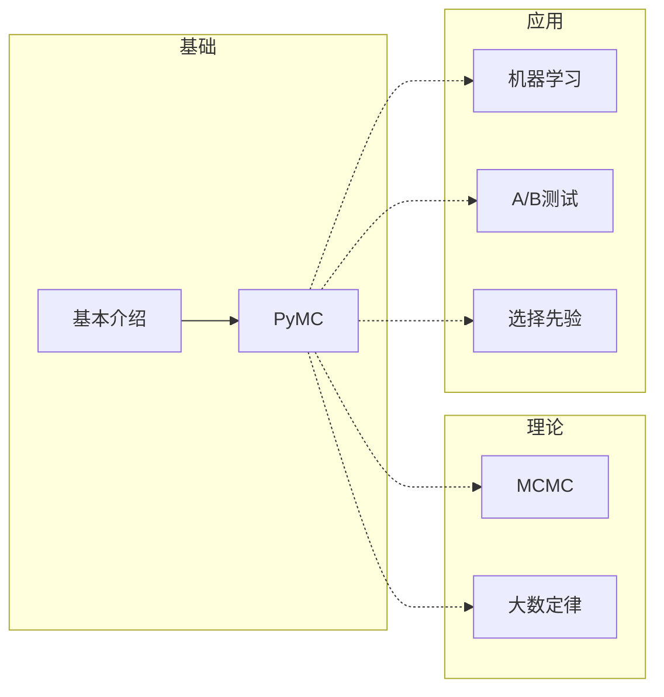

# 贝叶斯方法

[toc]

## Reference

**关联**：[[Python贝叶斯分析]]

**标签**： #贝叶斯; #统计学; #数据分析;

**引用**： Davidson-Pilon, Cameron. *贝叶斯方法：概率编程与贝叶斯推断*. [*Bayesian Methods for Hackers: Probabilistic Programming and Bayesian Inference*]. Translated by 辛愿, 钟黎 and 欧阳婷. 北京: 人民邮电出版社.

## 结构

### 总体结构



## 详细笔记

### 打开MCMC的黑盒子

#### MCMC算法的实现

标签: #MCMC

基本步骤：

1. 从当前位置开始
2. 尝试移动一个位置
3. 根据新的位置实际否服从于观测数据和先验分布，来决定采纳/拒绝这次移动
4. 如果采纳，再新的位置重复第一步；如果不采纳，留在原初，并重复第一步
5. 在大量迭代之后，返回所有采纳的点

### 大数定理

#### 具体表述

标签: #大数定律
$$
\begin{align}
\frac{1}{N}\sum_{i=1}^N Z_i \rightarrow E[Z], & N \rightarrow \infty
\end{align}
$$

#### 和贝叶斯的关系

* 方差越大，收敛速度越慢
* $N$很小的时候不成立
* 定律并不成立时，也无法得到可靠结果

#### 对Reddit网站上的评论进行排序

标签：#推荐, #热门推荐, #排序算法, #搜索

##### 主要问题

1. 数据倾斜：绝大多数评论只有少量票数，会有很多评论的好评率趋于极端（大数定理失效的情况）
2. 数据偏移：<u>用户在不同门类的议题评论上的太多极端程度会差很多</u>

##### 策略

进行后验拟合后比较95%下限

##### 速算

$$
\frac{a}{a + b} - 1.65 \sqrt{\frac{ab}{(a+b)^2(a+b+1))}}
$$

其中，$a$为赞同票数加一，$b$为反对票数加一

### 弄清楚先验

#### 先验选择

客观先验：无差别先验

主管先验：带有主观意见

#### 有用的先验

[PyMC3支持的连续型分布](https://docs.pymc.io/api/distributions/continuous.html)

##### Gamma分布

$$
f(x| \alpha, \beta) = \frac {\beta^{\alpha}x^{\alpha -1}e^{-\beta x}}{\Gamma(\alpha)}
$$

##### 威沙特(Wshart)分布

##### Beta分布

标签: #Beta分布;
$$
f_X(x| \alpha, \beta) = \frac{x^{\alpha -1}{(1 - x)^{(\beta - 1)}}}{B(\alpha, \beta)}
$$

#### 多臂老虎机问题

标签：#动态优化, #多臂老虎机; #Multi-Armed_Bandits

问题表述:

> 面前有多个老虎机，每一个老虎机发奖金的概率不同，用一个策略来最大化概率。

##### 应用

* 广告投放时，最大化收益
* 生态学：动物如何考虑行为的汇报
* 金融：随着时间变化，哪些股票期权能给出最高的回报
* 临床试验：众多方案中找到最好治疗方案。

##### 总体思路

1. 从老虎机$b$的先验中随机抽取**一**个样本$X_b$，对于所有的老虎机执行同样操作。
2. 选择样本值最高的老虎机，也就是说，选择$B = argmax\, X_b$
3. 观察拉动老虎机$B$的结果，更新$B$的先验（设定Bandit来考虑是不是要通过这一验证，来防止坠入局部数据）
4. 返回第一步 

关键：

设定一个Bandit概率使得有一定概率拒绝最大化的选择，因为$argmax$可能会在某一部进入局部最优不出来。

#### 从领域专家获得先验分布

##### 专家领域先验的好处

* 有助于MCMC收敛
* 允许更准确的推断
* 更好地表达了我们的不确定性

##### 专家领域先验的坏处

* 需要用非统计学知识沟通
* 人们往往忽视了罕见的长尾时间，并把太多权重放在分布的均值附近。
* 人们机会总是不能足够重视自己猜测的不确定性

### AB测试

标签: #AB测试

#### 增加一个线性损失函数来计算期望收入

标签: #带收入的AB测试

场景：

> 假设现在有一个页面存在$N$个收费方案，每个收费方案的获利用$R_i$表示，则可以肯定总的收入为：
> $$
> E[R] = \sum_{i=1}^{N} R_ip_i
> $$
> 其中，因为选择方案是互斥行为，所以
> $$
> \sum_{i=1}^{N}p_i = 1
> $$

##### 思路

* 先用AB测试测出点击观测之后两个方案的分别的概率
* 通过再抽样或者MCMC最后的结果来获取概率带入期望收入
* 比较两组期望收入的大小

##### Dirichlet(狄利克雷)分布

标签: #Dirichlet分布

* Dirichlet分布是Beta分布的推广。

* $Dirichlet(1, 1, 1, ...,1)$为均匀分布，如果观测量为$N_1$, $N_2$, ...$N_m$的话，则可以用类似Beta分布来写出后验为
  $$
  Dirichlet(1+N_1, 1+N_2, ..., 1+N_m)
  $$

#### BEST模型

标签: #组间比较, #贝叶斯

##### BEST模型概述

* 按一下方式描述每个分组的分布

* $M_{\mu}$和$S_{\mu}$设定为观测值的初始均值和方差
* $\sigma$设定为观测值的千分之一到一千倍
* 最后比较$\mu$即可，也可抽样比较概率

$$
x_i \sim StudentT(\mu, \sigma, \nu)\\
\mu \sim Normal(M_{\mu}, S_{\mu})\\
\sigma \sim Uniform(L_{\sigma}, H_{\sigma})\\
\nu \sim Exponential(\lambda_{\nu} = \frac{1}{29}) + 1
$$

#### 处理增幅

标签: #AB测试中的增幅

增幅常规最为不恰当的表述为：
$$
\frac{\hat{p}_{A} - \hat{p}_{B}}{\hat{p}_{B}}
$$
因为这样掩盖的波动性。

准确地做法是基于后验进行抽样，计算每个抽样$i$的
$$
r_{up,i} = \frac{{p}_{A, i} - {p}_{B, i}}{{p}_{B, i}}
$$
然后，通过计算下面式子来表述增幅。譬如，计算结果为0.555，则表示有55.5%得概率，增幅能达到0.2。

```python
expect_up = 0.2
(r_up_nparray - expect_up).mean()
```

