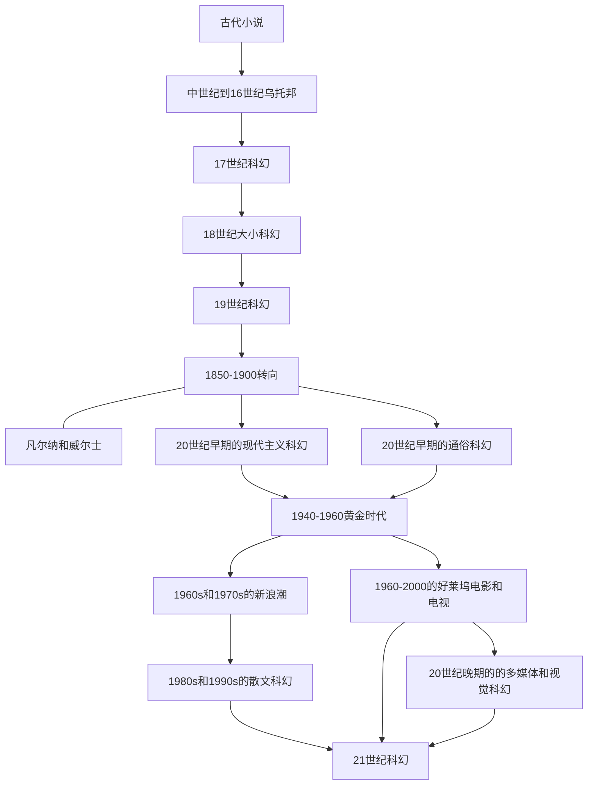

# The History of Science Fiction(Adam Roberts)

# META

**创建日期**: 2021-02-22

**参考等级**: ⭐⭐⭐⭐⭐🌕

**关联**: 

**标签**: #科幻; #流行文化;

**引用**: Roberts, Adam. *The History of Science Fiction*. Palgrave Histories of Literature. 2nd ed. UK: Palgrave Macmillan, 2016.

## 概述

# 结构

## 总体结构

# 正文分析

## Chap 11: 黄金时代

标签: #科幻黄金时代; #John_Campbell; 

### 简介

两个方向：

* 硬科幻（Hard SF）: 线性叙事，英雄解决问题或者应对太空和科技冒险
* 基于John W Campbell的品味，认为科幻该有的样子。

#### John W Campbell的生涯

* 在1938年写成畅销小说「Who Goes There?」，变成后面1951年的《***The Thing from Another World***》和卡朋特《怪形》的原型
* 是*Astounding*杂志主编，在1961年后改为*Analog*

### 阿西莫夫

标签: #阿西莫夫; 

* 后期有段时间生产了很多颇有洞识的非虚构作品。
* 在1940s~1950s的作品一般被归为黄金时代的作品
* 基于理性的创作（注意和新浪潮的区别）
* 所有机器人小说实质上是伦理虚构小说

主要作品集：

* 早期的是1941年短篇「Nightfall」
* 「基地系列」：主要对话为主，很少视觉描述
* 《***The Caves of Steel***》(1954)， 提出了机器人三大定律
* 《***Fundamental Principles of the Metaphysics of Ethics***》(1785)，非虚构作品

### 早期的海因

### 莱因

标签: #海因莱因

海因莱因提供了黄金时代SF的原型：

* 有力的、思考启发的剧情
* 主角穿越未知领域
* 和阿西莫夫比，更接近于Campbell提出的黄金时代SF该有的样子

海因莱因的生涯三阶段：

* 前期，代表作为《***Starship Troopers***》(1959)，乐观探索的特征
* 中期，对意识形态有种不约地形态，已经个体自由的特征，比如《***The Puppet Masters***》(1951)
* 后期，从《***The Number of the Beast***》(1980)开始，主要

其他主要作品：

* 《***Stranger in a Strange Land***》(1961)
* 《***Time Enough for Love***》(1973)

### 北美黄金时代作家

标签: #北美黄金时代作家

#### Jack Vance

#### Cleve Cartmill

#### Poul Anderson

#### Algis Budrys

#### Alfred Bester

### 战后英国

标签: #乔治奥威尔

乔治·奥威尔的***1984***(1959)

### Cosy Catastrophe和儿童疏离(alienness of Children)

标签: #Cosy_Catastrophe

Cosy Catastrophe的特征：

* 为后启示录的电影一种
* 大部分人类灭绝只剩几位主角
* 文明泯灭

### 宗教小说

* ***Behold the Man***(1969), Moorcock
* ***Lord of Light***(1967), Zelazny
* ***The Chrysalids***(1955), Wyndham
* ***A Case of Conscience***(1958), Blish
* ***The Handmaid's Tale***(1958), Atwood
* ***Grass***(1989), Sheri Tepper
* ***Hyperion***(Simmons, 1989)

#### Blish的「战火中的城市」系列(Cities in Flight)

### 欧洲1940s~1950s的SF

### 电影

### 视觉艺术家

### 喜剧

* 《惊奇队长冒险》(*Captain Marvel Adventures*, 1941-53)

### 欧洲喜剧

## Chap 12: 新浪潮(1960s~1970s)

### 简介

### 海因莱因、希尔伯特、Michael Moorcock、Barth

标签: #海因莱因; #Herbert; #Moorcock; #Barth; #约翰巴思

# 文摘

# 评论
