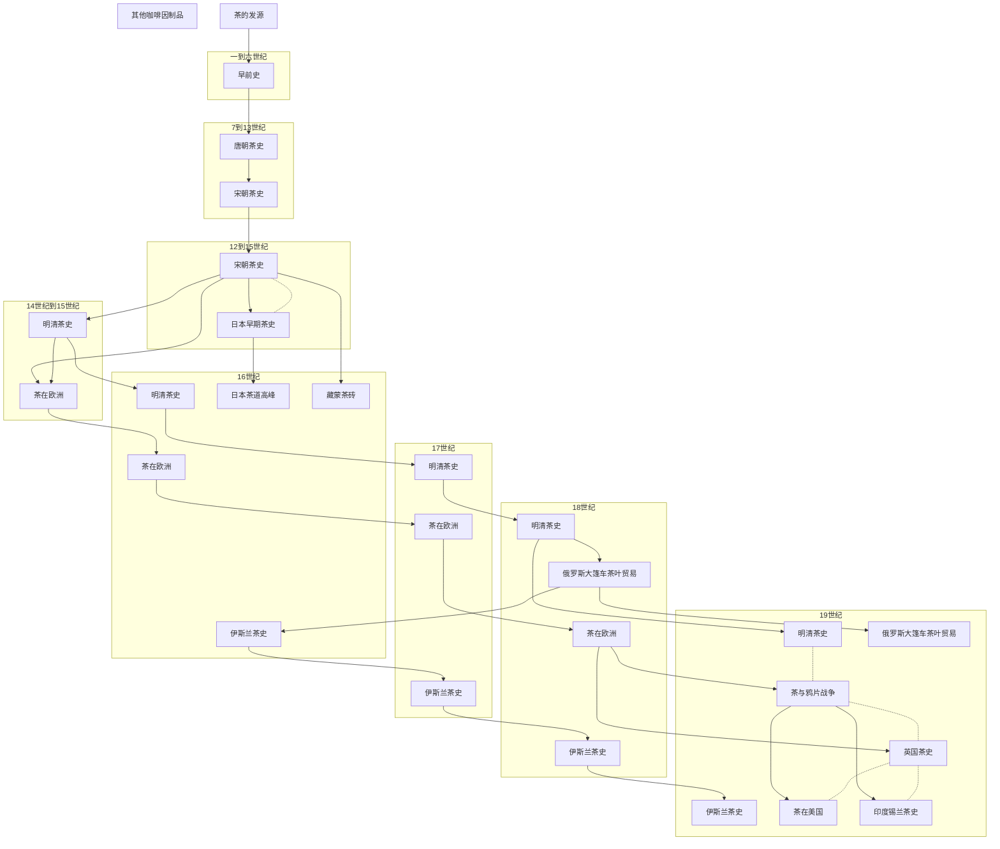

# 茶的真实历史

## META

**创建日期**: 2021-01-16

**关联**:

**标签**: #美食; #茶;

**引用**:

## 结构

### 总体结构

## 正文分析

## 文摘

### 1. 茶的禅机

标签：#茶的禅机

>(pp. 23)赵州问信道的和尚：「曾到此间」。
>
>和尚说：「曾到。」
>
>赵州说：「吃茶去。」又问另一个和尚。
>
>和尚说：「不曾到。」
>
>赵州说：「吃茶去。」
>
>院主听到后问：「为甚曾到也云吃茶去，不曾到也云吃茶去？」
>
>赵州说：「吃茶去。」

## 评论
