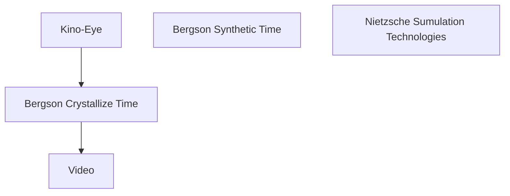

# Videophilosophy

## META

**创建日期**: 2021-01-26

**参考等级**: ⭐⭐⭐⭐⭐🌕

**关联**: 

**标签**: #影像; #影像哲学; #Lazzarato; #视频哲学

**引用**: Lazzarato, Maurizio. *Videophilosophy: The Perception of Time in Post-Fordism*. Columbia University Press, 2019.

### 概述

## 结构

### 总体结构

## 正文分析

### Kino-eye和Vertov

## 文摘

## 评论
