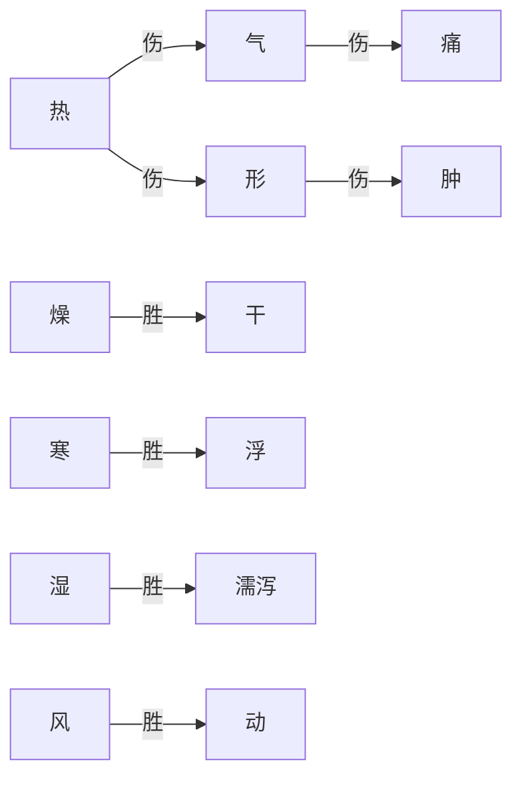

# 黄帝内经(倪海厦)

标签: #中医; #黄帝内经 

## 五. 阴阳应象

### 阳胜则热，阴胜则寒；重阳则寒，重寒则热

```mermaid
graph LR

热 --伤--> 气 --伤--> 痛

热 --伤--> 形 --伤--> 肿

燥 --胜--> 干

寒 --胜--> 浮

湿 --胜--> 濡泻

风 --胜--> 动

```

### 难经七十五

子能实母，母能虚子。克平，生虚实。

| 虚实 | 东方实 | 西方虚 |
| ---- | :----: | :----: |
|      |   木   |   金   |
|      |  泻南  |  补北  |

