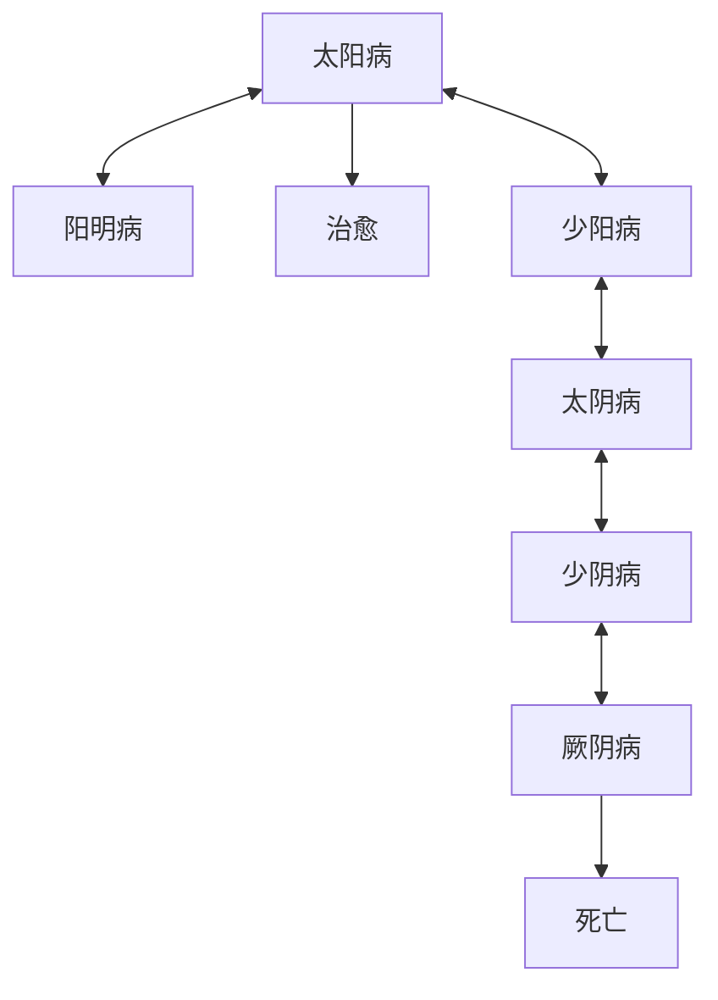
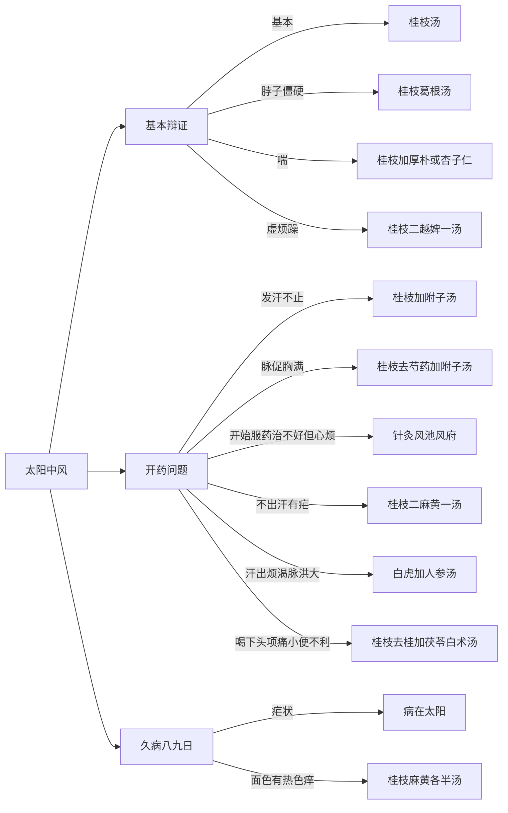

# 倪海厦伤寒

# META

**创建日期**: 2021-04-19

**参考等级**: ⭐⭐⭐

**关联**: 

**标签**: #2021-04-01; #中医; #倪海厦

**引用**: 

## 概述

# 结构

## 总体结构

# 正文分析

## 太阳病

### 三类病症

* 中风：发热、汗出、恶风、脉缓 --> 桂枝汤
* 伤寒：无汗、（发热不发热等其他现象无关） --> 麻黄汤
* 温病：发汗而渴，不恶寒

### 阴阳发病机理（6天）

* 发热恶寒，发于阳（指白天发病）
* 无，发于阴

### 寒热相对

* 身大热，反而像穿衣服，因为皮肤热，骨髓冷
* 身寒，却不想穿衣，则寒在皮肤，热在骨髓

#### 辨别真假寒热的方法

|  部位  |            真热假寒            |             真寒假热              |
|:-----:|:--------------------------:|:-----------------------------:|
|  面色  | 脸颊红，红色鲜艳，不红则白种带青 |        面色虽冷，但两目有神        |
| 口鼻气 |      气不温、不急促、气不臭      |         呼出温，急促、不臭          |
|   舌   |      干但颜色淡，红而湿润       | 舌干燥、苔薄根厚、黄而疏松、润而齿枯 |
|  脉象  |            按之无力            |            脉细，但数急            |
|  胸腹  |        不蒸手，不觉得热         |   四肢寒、胸腹热、久按蒸蒸热气感    |

### 太阳中风

基本的处方：

> 桂枝汤：
>
> - 桂枝三两去皮
> - 芍药三两
> - 甘草二两炙
> - 生姜二两切
> - 大枣十二枚劈

### 阳明

往来寒热

### 太阴

呕吐，往来寒热

### 少阴

小便白、便秘

### 厥阴

上热下冷

### 总结

* 太阳病（发热恶寒）
  * 桂枝汤（有汗）
  * 麻黄汤（无汗）
  * 葛根汤（）
* 阳明病
  * 大辰气
  * 小辰气
* 少阳病(胸胁苦满)
  * 小柴胡

# 文摘

# 评论
