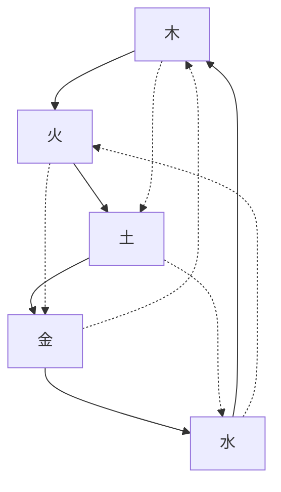

# 黄帝内经(南京中医药大学笔记)

## META

**创建日期**: 2021-01-19

**关联**:

**标签**: #中医; #中国文化; #黄帝内经;

**引用**:

## 结构

### 总体结构

## 正文分析

### 第一章 阴阳五行

### 第三章 摄生

## 文摘

### 1. 阴阳

> 阴阳者，天地之道也，万物之纲纪，变化之父母，生杀之本始，神明之府也。治病必求于本。(Kindle 位置 149-150)

> 积阳在天，积阴为地。阴静阳躁。阳生阴长，阳杀阴藏。阳化气，阴成形。（《素问·阴阳应象大论》）(Kindle 位置 176-177)

> 天地者，万物之上下也；阴阳者，血气之男女也；左右者，阴阳之道路也；水火者，阴阳之征兆也；阴阳者，万物之能始也。（《素问·阴阳应象大论》）(Kindle 位置 212-213).

> 天为阳，地为阴；日为阳，月为阴……阴阳者数之可十，推之可百，数之可千，推之可万，万之大，不可胜数，然其要一也……阴阳之变，其在人者，亦数之可数。（《素问·阴阳离合论》）(Kindle 位置 232-233).  

## 评论
