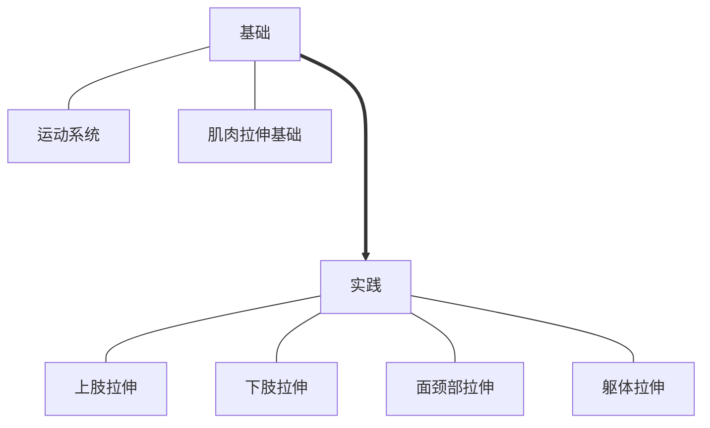

# 跟难缠的疼痛说“拜拜”：自我拉伸锻炼

# META

**创建日期**: 2021-04-13

**参考等级**: ⭐⭐⭐⭐⭐🌕

**关联**: 

**标签**: #2021-04-01; #拉伸; #物理治疗; #自我拉伸

**引用**: 黄强民, 张辉, and 谭树生. *跟难缠的疼痛说“拜拜”：自我拉伸锻炼*. 北京: 人民卫生出版社, 2016.

## 概述

# 结构

## 总体结构

# 正文分析

## 认识运动系统

### 骨骼肌分类

* 长肌：在四肢
* 羽状肌或半羽状肌：像鸟羽一样
* 轮匝肌
* 短肌
* 扁肌

### 肌肉图

### 肌肉状态

### 肌肉纤维

## 肌肉拉伸基础

### 拉伸的种类

* 冲击拉伸：类似瑜伽动作
* 逐渐拉伸

### 肌肉拉伸动作

1. 找到想要拉伸的部位，检查是否紧张
2. 找到主动肌，拉紧5秒不用移动，这样使得鸡头预热，准备拉伸
3. 放松几秒钟，进行初拉伸，使得与它们正常工作的位置相反。通过眼睛和呼吸控制准确度。
4. 慢慢主见拉伸，感到疼痛应该停止联系，坚持15 s ~ 1 min不要移动或者摇晃，甚至更长的时间

> 要找到拮抗肌并且刺激。

## 上肢问题

### 自我诊断

### 肩关节自我拉伸

