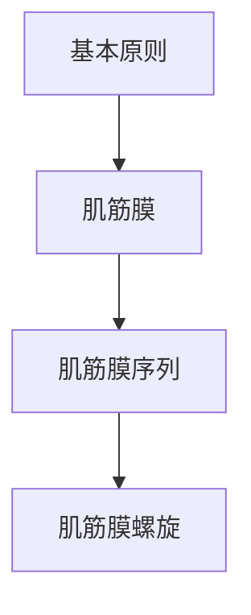

# 筋膜手法治疗骨骼肌肉疼痛

# META

**创建日期**: 2021-03-24

**参考等级**: ⭐⭐⭐⭐⭐🌕

**关联**: 

**标签**: #2021-03-01; #筋膜; #物理治疗;

**引用**: [意]路易吉·斯德科. *筋膜手法治疗肌肉骨骼疼痛.*[*ascial Manipulation fro Musculoskeletal Pain*. Translated by 关玲. 北京: 人民卫生出版社, 2018.

## 概述

# 结构

## 总体结构

# 正文分析

## 0. 基本原则

### 筋膜的微观结构

## 1. 肌筋膜单元的解剖

## 3. 肌筋膜单元的生理

主要作用：

* 协调中心和感知中心
* 主动肌和拮抗肌的作用

## 4. 上肢肌筋膜单元

## 5. 躯干筋膜单元

## 6. 下肢筋膜单元

## 7. 筋膜单元的手法治疗

## 8. 筋膜序列解剖

### 筋膜的作用

* 连接作用：
  * 沿同一方向运动单元连接到一起
  * 链接躯干或肢体同一方向运动的所有筋膜单元
* 隔离作用
  * 讲一块肌肉纤维分割成双关节纤维和单关节纤维两部分
* 感知身体在三个平面上的运动功能

### 终止于末端

## 10. 筋膜序列的生理

## 11. 上肢肌肉序列

## 12. 躯干筋膜序列

## 13. 下肢筋膜序列

## 14. 筋膜序列的手法操作

## 15. 筋膜螺旋的解剖

## 17. 筋膜螺旋生理学

### 步态分析

### 与经络间的关系

## 18. 上肢筋膜螺旋

## 19. 躯干的筋膜螺旋

## 20. 下肢筋膜螺旋

## 21. 筋膜螺旋操作

### 面部肌肉

### 治疗假设

