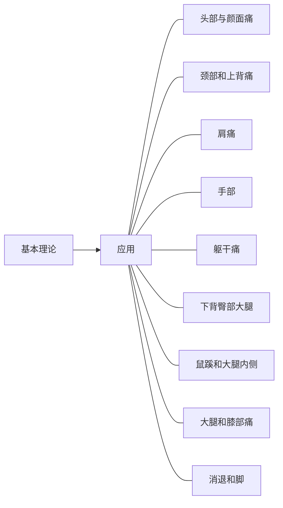

# 肌筋膜激痛点自我照顾手册

# META

**创建日期**: 2021-03-28

**参考等级**: ⭐⭐⭐⭐⭐🌕

**关联**: 

**标签**: #2021-03-01; #筋膜; #激痛点; #物理治疗 

**引用**: Finando, Donna. *肌筋膜激痛點自我照顧手冊：恢復自在得活動*. [*Trigger Point Self-Care Manual: For Pain-Free Movement*]. Translated by 郭芳娟 and 高文彬. 臺北: 合記圖書出版社, 2005.

## 概述

# 结构

## 总体结构

# 正文分析

# 文摘

# 评论
